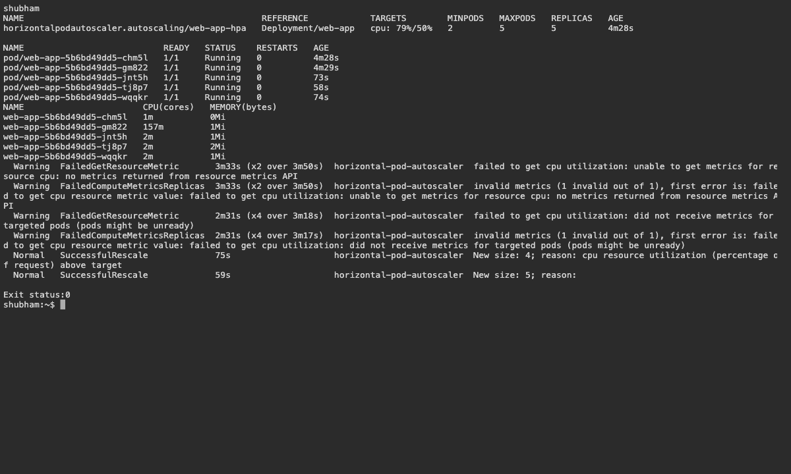
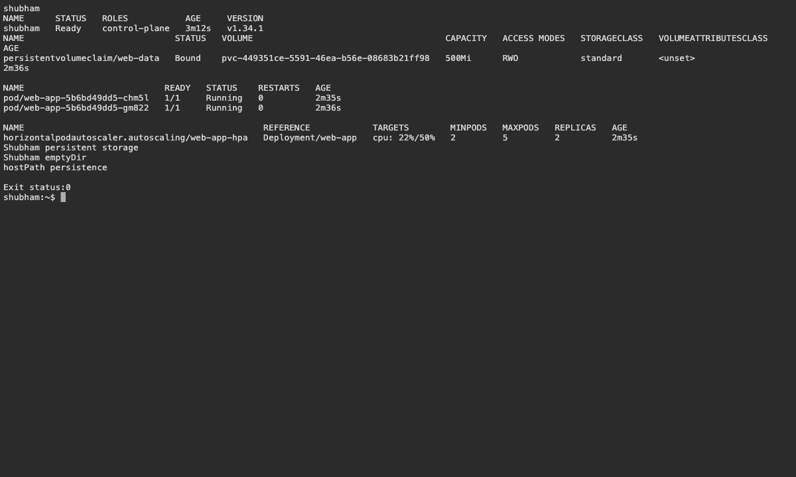

# 13 — Storage, Autoscaling and Health Checks

Name: Shubham Kumar

Enrollment number: 24BCS10320

## Lab

Deployed nginx with persistent storage and startup, readiness and liveness probes. The hostPath directory is `/tmp/shubham-hostpath-data`, mounted at `/shubham-data`.

| Item | Role |
|---|---|
| emptyDir | Temporary storage shared inside a Pod |
| hostPath | Mounts a node directory |
| PV / PVC | Available storage and the application's storage request |
| StorageClass | Selects the dynamic provisioner |
| HPA | Adjusts replicas using CPU utilization |

```bash
bash assignment-scripts/session13.sh
bash assignment-scripts/session13-load.sh
kubectl get pvc,hpa,pods -n production-webapp
kubectl top pods -n production-webapp
```

The 500 MiB PVC became Bound. Read/write checks passed, and CPU load increased replicas from 2 to 5. Readiness controls traffic; liveness restarts an unhealthy container; startup protects initialization. The separate HTTP load-generator workflow is prepared for execution after publication.

## Screenshots





## Command output

- [cluster](logs/cluster.log)
- [hpa](logs/hpa.log)
- [storage](logs/storage.log)
