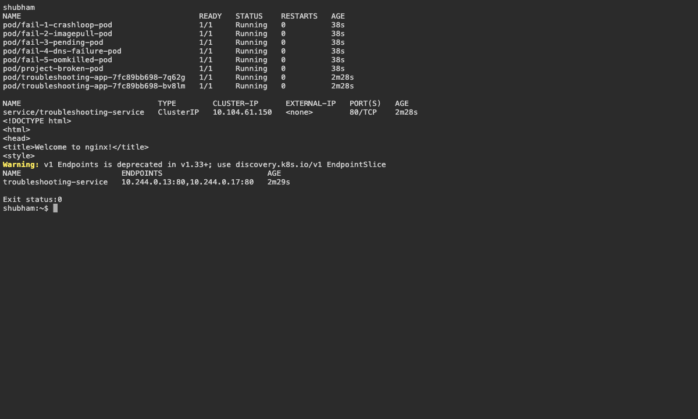
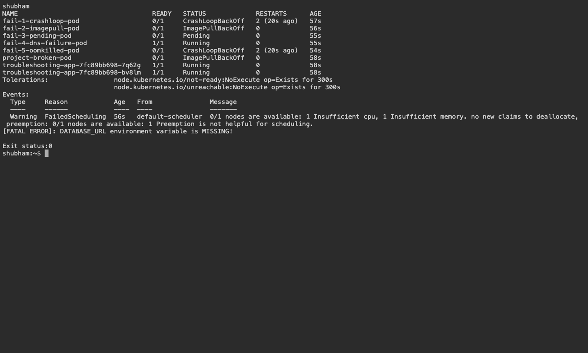

# 14 — Diagnose and Repair Kubernetes Workloads

Name: Shubham Kumar

Enrollment number: 24BCS10320

## Faults and fixes

| Problem | Diagnosis | Fix |
|---|---|---|
| CrashLoopBackOff | Application logs showed missing configuration | Added DATABASE_URL |
| ImagePullBackOff | Events showed an invalid image | Corrected the image tag |
| Pending | Requested resources exceeded node capacity | Reduced requests |
| DNS failure | Checked hostname, labels and endpoints | Corrected Service discovery |
| OOMKilled | Checked the previous termination reason | Bounded allocation and memory limits |

```bash
bash assignment-scripts/session14.sh
bash assignment-scripts/session14-fix.sh
kubectl get pods,services,endpoints -n troubleshooting
```

Result: all eight Pods ran after the fixes. Changing the Service selector removed its endpoints; restoring the matching label restored connectivity.

## Screenshots





## Command output

- [after](logs/after.log)
- [before](logs/before.log)
