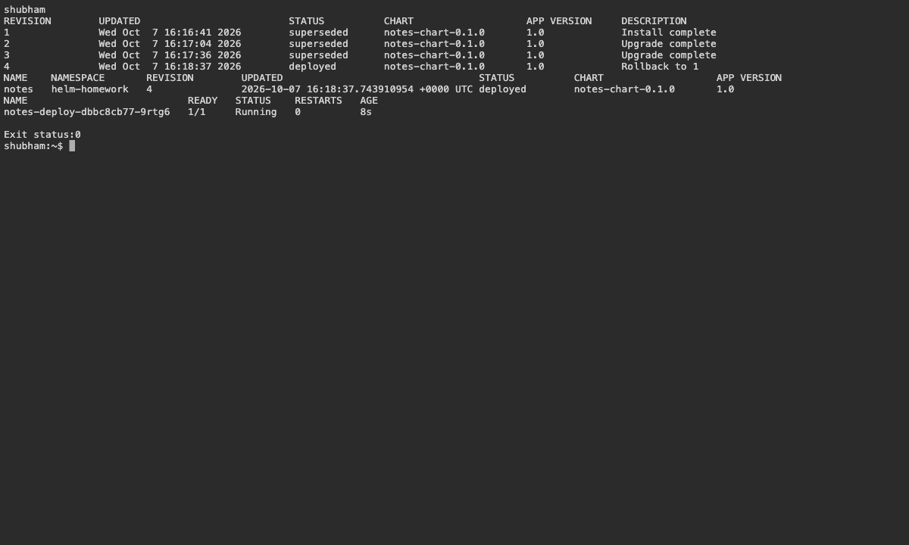

# 15 — Helm Release Management

Name: Shubham Kumar

Enrollment number: 24BCS10320

## Release exercise

The Notes chart contains a Deployment, Service and ConfigMap. Development uses nginx 1.26; production values use two replicas with nginx 1.27. The next upgrade uses three replicas with nginx 1.28.

```bash
bash assignment-scripts/session15.sh
helm list -n helm-homework
helm history notes -n helm-homework
helm get values notes -n helm-homework
```

Result: chart lint, repository search, install, two upgrades and rollback passed. Rollback to revision 1 created revision 4 and restored one nginx 1.26 Pod. The release was then removed.

## Screenshots



## Command output

- [releases](logs/releases.log)
