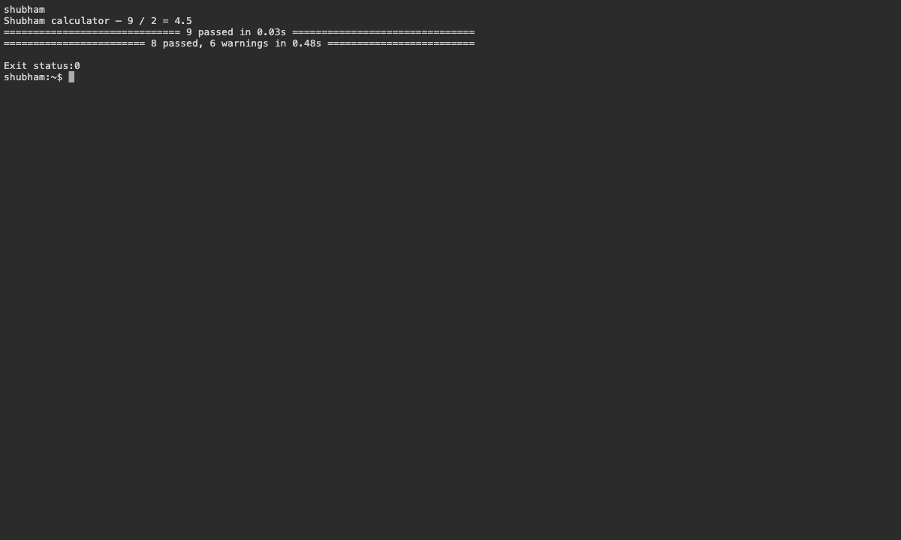

# 16 — Calculator CI

Name: Shubham Kumar

Enrollment number: 24BCS10320

## Application and workflow

The calculator supports addition, subtraction, multiplication and division. Tests include negative results, zero multiplication, fractional division and division by zero.

```bash
cd session-16-github-actions/demo
pip install -r requirements.txt
python -m pytest -v
bash build.sh
docker build -t shubham-calculator .
docker run --rm shubham-calculator
```

Result: 9 tests passed and the build completed. The Docker example calculated `9 / 2 = 4.5`.

A runner executes jobs; jobs contain steps. Secrets supply sensitive runtime values, and artifacts retain build output. CI checks changes; CD deploys validated changes.

[Workflow](../../.github/workflows/homework-ci.yml). GitHub execution is pending.

## Screenshots



## Command output

- [calculator](logs/calculator.log)
