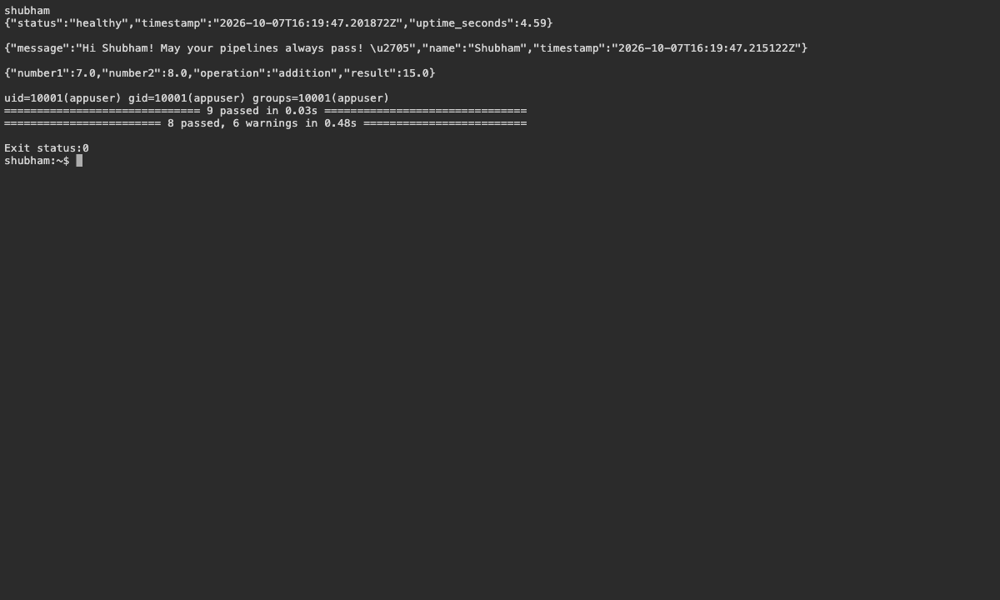
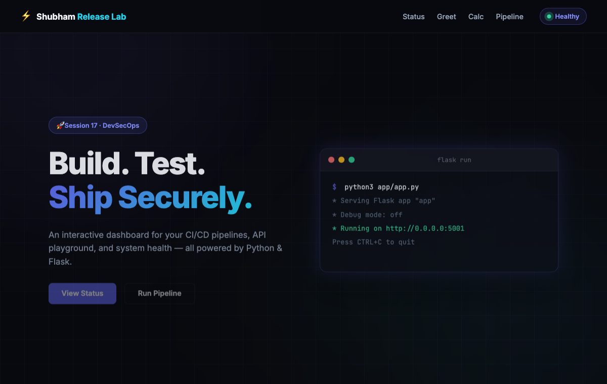
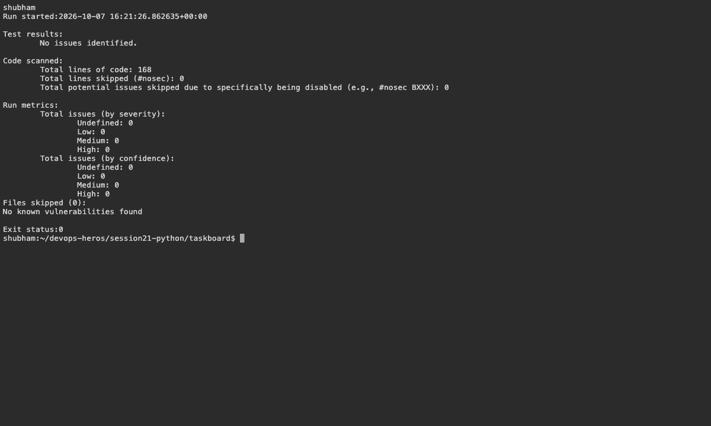

# 17 — Release Lab and DevSecOps

Name: Shubham Kumar

Enrollment number: 24BCS10320

## Release flow

```text
Tests → SAST → dependency scan → secret scan
      → image build → image scan → registry → Kubernetes
```

```bash
bash assignment-scripts/session16-17.sh
curl http://localhost:8081/health
curl http://localhost:8081/api/greet/Shubham
curl -H 'Content-Type: application/json' \
  -d '{"number1":7,"number2":8}' http://localhost:8081/api/add
```

Result: 8 Flask tests passed with 69% coverage. The API returned healthy status, greeted Shubham and calculated 15. The container ran as UID 10001 with debug mode disabled. Local Bandit, dependency and secret scans passed.

[Pipeline](../../.github/workflows/devsecops.yml) and [scan settings](../demo/SECURITY.md). GitHub scans, registry push and CI deployment are pending; local checks are recorded below.

## Screenshots







## Command output

- [secret scan](logs/secret-scan.log)
- [security](logs/security.log)
- [tests api](logs/tests-api.log)
