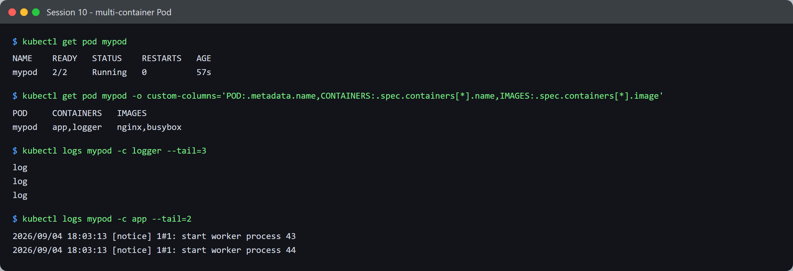
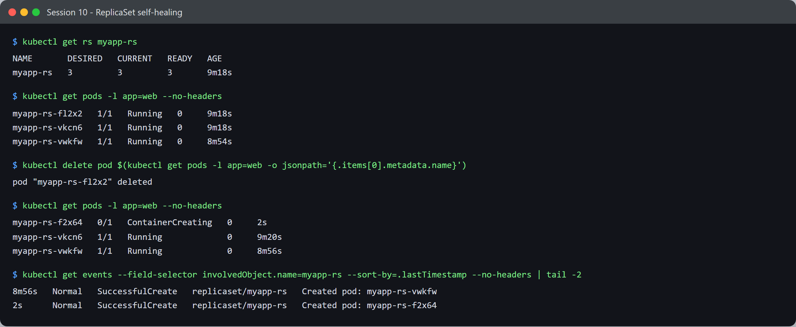
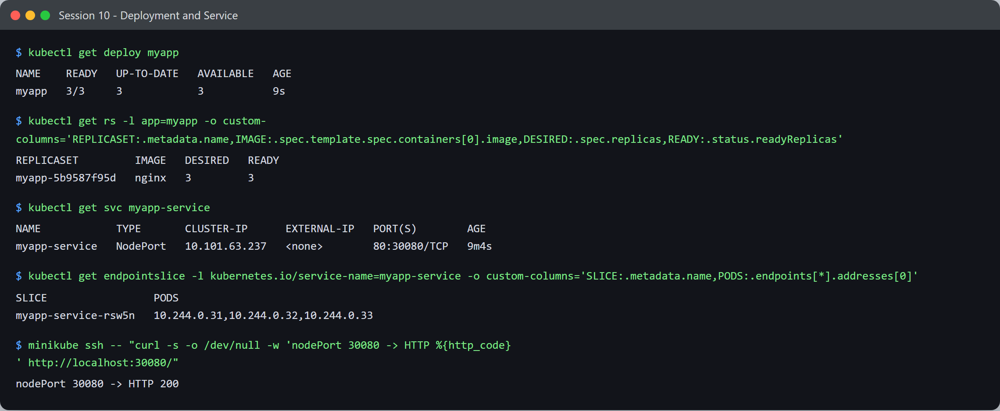
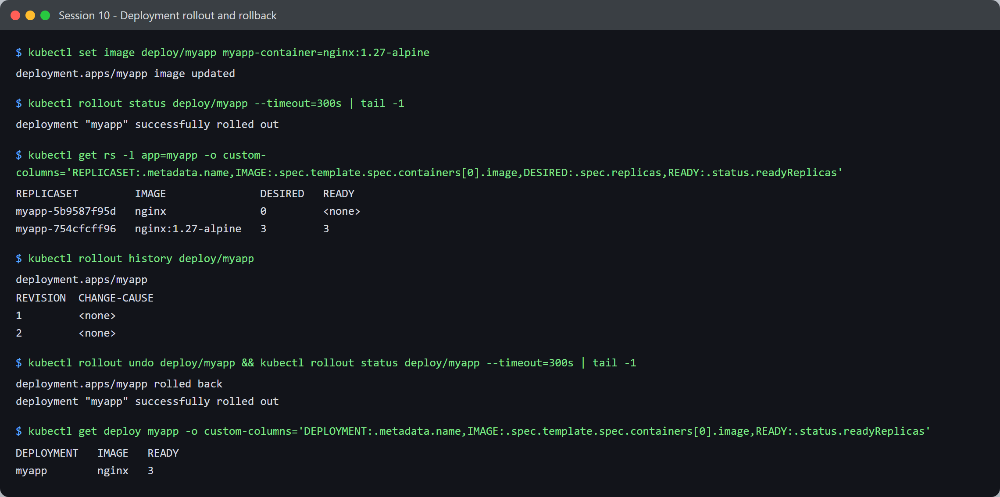
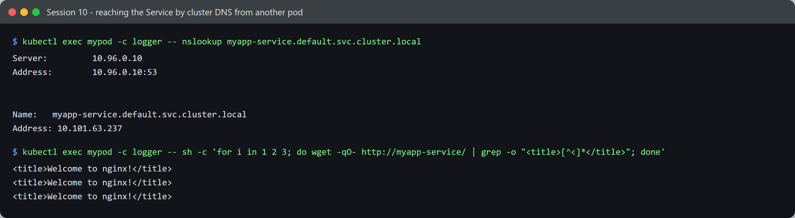
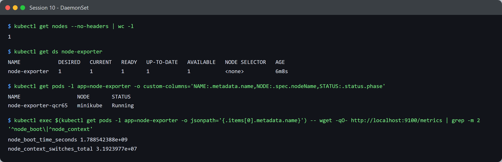
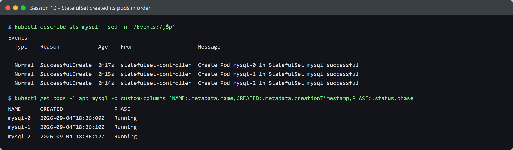
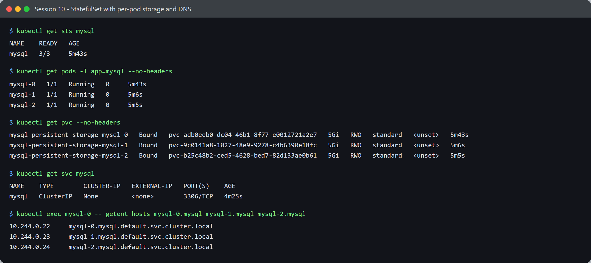

# Session 10 — Kubernetes Core Objects — Task

- **Name:** Shubham Kumar
- **Enrollment No:** 24BCS10320

---

## What the task asked

[`../Readme.md`](../Readme.md) links to a `core-objects.md` reference rather than stating a
task, but the session ships manifests in
[`../k8s-core-objects/`](../k8s-core-objects/). So I took the task to be: apply each core
object, then demonstrate the behaviour that makes it different from the others — not just
show it exists.

Cluster: minikube v1.39.0, Kubernetes v1.37.0 (set up in
[session 9](../../session9-k8s/task/)).

---

## 1. Pod — the unit of scheduling

[`../k8s-core-objects/pod.yml`](../k8s-core-objects/pod.yml) defines **two** containers in one pod.

```bash
kubectl apply -f ../k8s-core-objects/pod.yml
```



```text
$ kubectl get pod mypod
NAME    READY   STATUS    RESTARTS   AGE
mypod   2/2     Running   0          57s

$ kubectl get pod mypod -o custom-columns='POD:.metadata.name,CONTAINERS:.spec.containers[*].name,IMAGES:.spec.containers[*].image'
POD     CONTAINERS   IMAGES
mypod   app,logger   nginx,busybox

$ kubectl logs mypod -c logger --tail=3
log
log
log

$ kubectl logs mypod -c app --tail=2
2026/09/04 18:03:13 [notice] 1#1: start worker process 43
2026/09/04 18:03:13 [notice] 1#1: start worker process 44
```

`READY 2/2` is the point: a pod is not "a container", it is a group of containers that share
a network namespace and lifecycle. Because there are two, `kubectl logs` needs `-c` to say
which one — without it you get an error listing your choices. This is the sidecar pattern:
`app` serves, `logger` runs alongside it.

---

## 2. ReplicaSet — keeps N pods alive

```bash
kubectl apply -f ../k8s-core-objects/replicaset.yml   # replicas: 3, selector app=web
```



```text
$ kubectl get rs myapp-rs
NAME       DESIRED   CURRENT   READY   AGE
myapp-rs   3         3         3       9m18s

$ kubectl get pods -l app=web --no-headers
myapp-rs-fl2x2   1/1   Running   0   9m18s
myapp-rs-vkcn6   1/1   Running   0   9m18s
myapp-rs-vwkfw   1/1   Running   0   8m54s
```

Now delete one by hand and look immediately:

```text
$ kubectl delete pod myapp-rs-fl2x2
pod "myapp-rs-fl2x2" deleted

$ kubectl get pods -l app=web --no-headers
myapp-rs-f2x64   0/1   ContainerCreating   0   2s     <- brand new
myapp-rs-vkcn6   1/1   Running             0   9m20s
myapp-rs-vwkfw   1/1   Running             0   8m56s

$ kubectl get events --field-selector involvedObject.name=myapp-rs
8m56s   Normal   SuccessfulCreate   replicaset/myapp-rs   Created pod: myapp-rs-vwkfw
2s      Normal   SuccessfulCreate   replicaset/myapp-rs   Created pod: myapp-rs-f2x64
```

I caught the replacement at 2 seconds old, still `ContainerCreating`, and the controller
logged `SuccessfulCreate` for it. **The replacement has a different name** — the ReplicaSet
guarantees *how many* pods match its selector, not that any particular pod survives. Pods
are disposable; the count is the contract.

---

## 3. Deployment — manages ReplicaSets, so it can roll

```bash
kubectl apply -f ../k8s-core-objects/deployment.yml
```



```text
$ kubectl get deploy myapp
NAME    READY   UP-TO-DATE   AVAILABLE   AGE
myapp   3/3     3            3           9s

$ kubectl get rs -l app=myapp
REPLICASET         IMAGE   DESIRED   READY
myapp-5b9587f95d   nginx   3         3
```

Note the ownership chain: **Deployment → ReplicaSet → Pods**. I never created that
ReplicaSet; the Deployment did, and its name carries a hash of the pod template.

### Rollout and rollback



```text
$ kubectl set image deploy/myapp myapp-container=nginx:1.27-alpine
deployment.apps/myapp image updated

$ kubectl rollout status deploy/myapp
deployment "myapp" successfully rolled out

$ kubectl get rs -l app=myapp
REPLICASET         IMAGE               DESIRED   READY
myapp-5b9587f95d   nginx               0         <none>    <- old, scaled to zero
myapp-754cfcff96   nginx:1.27-alpine   3         3         <- new
```

**This is why Deployments exist.** Changing the image created a *second* ReplicaSet and
shifted replicas from the old to the new one gradually — the `rollout status` output stepped
through `1 out of 3 new replicas have been updated`, then 2, then
`1 old replicas are pending termination`. The old ReplicaSet is kept at 0 replicas rather
than deleted, which is what makes rollback instant:

```text
$ kubectl rollout history deploy/myapp
REVISION  CHANGE-CAUSE
1         <none>
2         <none>

$ kubectl rollout undo deploy/myapp
deployment.apps/myapp rolled back
deployment "myapp" successfully rolled out

$ kubectl get deploy myapp
DEPLOYMENT   IMAGE   READY
myapp        nginx   3
```

Rolling back just scales the old ReplicaSet back up. A bare ReplicaSet cannot do any of
this — it has one template and no history.

---

## 4. Service — a stable address for changing pods

```bash
kubectl apply -f ../k8s-core-objects/service.yml   # NodePort 30080 -> 80, selector app=myapp
```

```text
$ kubectl get svc myapp-service
NAME            TYPE       CLUSTER-IP      EXTERNAL-IP   PORT(S)        AGE
myapp-service   NodePort   10.101.63.237   <none>        80:30080/TCP   9m4s

$ kubectl get endpointslice -l kubernetes.io/service-name=myapp-service
SLICE                 PODS
myapp-service-rsw5n   10.244.0.31,10.244.0.32,10.244.0.33
```

The Service found all three pods by label and listed them as endpoints. It did not need to
know their names or IPs in advance — the selector does the work, which is exactly why pods
being disposable (section 2) is workable.

Reached two ways. First by **cluster DNS from another pod** — I exec'd into the busybox
`logger` container of `mypod` rather than creating anything new:



```text
$ kubectl exec mypod -c logger -- nslookup myapp-service.default.svc.cluster.local
Server:		10.96.0.10
Address:	10.96.0.10:53

Name:	myapp-service.default.svc.cluster.local
Address: 10.101.63.237

$ kubectl exec mypod -c logger -- sh -c 'for i in 1 2 3; do wget -qO- http://myapp-service/ | grep -o "<title>[^<]*</title>"; done'
<title>Welcome to nginx!</title>
<title>Welcome to nginx!</title>
<title>Welcome to nginx!</title>
```

`10.96.0.10` is CoreDNS (the `kube-dns` Service), and it resolved the name to the Service's
ClusterIP `10.101.63.237` — matching `kubectl get svc` above.

Note the two forms. The lookup used the **FQDN**, while the fetches used the bare
`myapp-service` and still worked, because pods are given a DNS search list
(`default.svc.cluster.local`, `svc.cluster.local`, `cluster.local`). Worth knowing that
busybox's `nslookup` tries every suffix and prints `NXDOMAIN` for the ones that miss before
hitting the right one — that output looks like a failure but is just the search walk, which
is why I queried the FQDN directly here.

Second, on the **NodePort from the node**:

```text
$ minikube ssh -- curl -s -o /dev/null -w 'nodePort 30080 -> HTTP %{http_code}\n' http://localhost:30080/
nodePort 30080 -> HTTP 200
```

**Service types, and which to use:**

| Type | Reachable from | Use |
|---|---|---|
| `ClusterIP` (default) | inside the cluster only | internal services |
| `NodePort` | any node IP on a high port (30000–32767) | dev/testing, or behind your own load balancer |
| `LoadBalancer` | external IP from the cloud provider | production on a cloud |
| headless (`clusterIP: None`) | per-pod DNS, no load balancing | StatefulSets — see section 6 |

---

## 5. DaemonSet — one pod per node

```bash
kubectl apply -f ../k8s-core-objects/deamonset.yml
```



```text
$ kubectl get nodes --no-headers | wc -l
1

$ kubectl get ds node-exporter
NAME            DESIRED   CURRENT   READY   UP-TO-DATE   AVAILABLE   NODE SELECTOR   AGE
node-exporter   1         1         1       1            1           <none>          6m8s

$ kubectl get pods -l app=node-exporter
NAME                  NODE       STATUS
node-exporter-qcr65   minikube   Running
```

`DESIRED 1` — and I never wrote `replicas: 1` anywhere. A DaemonSet has **no replica count**;
the desired number *is* the number of matching nodes. On a 10-node cluster this would be 10,
and adding a node would automatically get a pod. That is the whole difference from a
Deployment, and it is why node agents (metrics, log shippers, CNI) are DaemonSets.

It really is exporting metrics:

```text
$ kubectl exec node-exporter-qcr65 -- wget -qO- http://localhost:9100/metrics | grep '^node_'
node_boot_time_seconds 1.788542388e+09
node_context_switches_total 3.1923977e+07
```

---

## 6. StatefulSet — stable identity and per-pod storage

```bash
kubectl apply -f ../k8s-core-objects/statefulset.yml   # mysql, replicas: 3
```

### Pods are created one at a time, in order

Rather than trying to catch the race by polling, the controller's own events and the pod
creation timestamps record it permanently:



```text
$ kubectl describe sts mysql | sed -n '/Events:/,$p'
Events:
  Type    Reason            Age    From                    Message
  ----    ------            ----   ----                    -------
  Normal  SuccessfulCreate  2m17s  statefulset-controller  Create Pod mysql-0 in StatefulSet mysql successful
  Normal  SuccessfulCreate  2m15s  statefulset-controller  Create Pod mysql-1 in StatefulSet mysql successful
  Normal  SuccessfulCreate  2m14s  statefulset-controller  Create Pod mysql-2 in StatefulSet mysql successful

$ kubectl get pods -l app=mysql -o custom-columns='NAME:.metadata.name,CREATED:.metadata.creationTimestamp,PHASE:.status.phase'
NAME      CREATED                PHASE
mysql-0   2026-09-04T18:36:09Z   Running
mysql-1   2026-09-04T18:36:10Z   Running
mysql-2   2026-09-04T18:36:12Z   Running
```

`mysql-0` was created first, then `mysql-1`, then `mysql-2` — strictly one after another, and
the `statefulset-controller` logged each one separately. A Deployment issues all its pod
creations at once; a StatefulSet will not create `mysql-1` until `mysql-0` is Ready. That is
what lets a database elect a primary and have replicas join in a known sequence.

The gaps here are only 1–3 seconds because this was a re-apply and the PersistentVolumeClaims
already existed, so MySQL had no first-time initialisation to do. On the very first apply the
same sequence took roughly 40 seconds end to end, with each pod visibly `Pending` while the
one before it started.

Names are also **ordinal and stable**: `mysql-0/1/2`, not random suffixes. If `mysql-1` dies
its replacement is called `mysql-1` again and gets the same storage back.



```text
$ kubectl get sts mysql
NAME    READY   AGE
mysql   3/3     5m43s

$ kubectl get pods -l app=mysql --no-headers
mysql-0   1/1   Running   0   5m43s
mysql-1   1/1   Running   0   5m6s
mysql-2   1/1   Running   0   5m5s

$ kubectl get pvc --no-headers
mysql-persistent-storage-mysql-0   Bound   pvc-adb0eeb0-...   5Gi   RWO   standard
mysql-persistent-storage-mysql-1   Bound   pvc-9c0141a8-...   5Gi   RWO   standard
mysql-persistent-storage-mysql-2   Bound   pvc-b25c48b2-...   5Gi   RWO   standard
```

Each pod got its **own** 5Gi PersistentVolumeClaim, named after the pod. That comes from
`volumeClaimTemplates` — a Deployment has no equivalent, so all its replicas would share one
volume or none. Three separate databases need three separate disks, which is the reason
StatefulSet exists.

### A bug in the provided manifest — and the fix

`statefulset.yml` declares `serviceName: "mysql"`, but **there is no Service named `mysql`
anywhere in the repo**. The pods still start, so it looks fine, but the per-pod DNS a
StatefulSet is supposed to provide does not work:

```text
$ nslookup mysql-0.mysql.default.svc.cluster.local
** server can't find mysql-0.mysql.default.svc.cluster.local: NXDOMAIN

$ kubectl get svc mysql
Error from server (NotFound): services "mysql" not found
```

I added the missing headless Service —
[`../k8s-core-objects/mysql-headless-service.yml`](../k8s-core-objects/mysql-headless-service.yml):

```yaml
apiVersion: v1
kind: Service
metadata:
  name: mysql
spec:
  clusterIP: None      # headless: no load balancing, one DNS record per pod
  selector:
    app: mysql
  ports:
    - port: 3306
```

After applying it:

```text
$ kubectl get svc mysql
NAME    TYPE        CLUSTER-IP   EXTERNAL-IP   PORT(S)    AGE
mysql   ClusterIP   None         <none>        3306/TCP   4m25s

$ kubectl exec mysql-0 -- getent hosts mysql-0.mysql mysql-1.mysql mysql-2.mysql
10.244.0.22     mysql-0.mysql.default.svc.cluster.local
10.244.0.23     mysql-1.mysql.default.svc.cluster.local
10.244.0.24     mysql-2.mysql.default.svc.cluster.local
```

Each pod is now individually addressable. `clusterIP: None` is the key — a normal Service
hands out one virtual IP and load-balances across pods, which is the opposite of what you
want when you need to talk to *replica 2 specifically*.

---

## Summary — which object for what

| Object | Guarantees | Reach for it when |
|---|---|---|
| **Pod** | one or more containers, co-scheduled, shared network | almost never directly — nothing recreates it |
| **ReplicaSet** | N pods matching a selector stay alive | rarely directly; a Deployment owns one for you |
| **Deployment** | ReplicaSets + rolling updates + rollback history | stateless apps — the normal default |
| **Service** | stable IP/DNS in front of changing pods | anything that needs to be reachable |
| **DaemonSet** | exactly one pod per (matching) node | node-level agents: metrics, logs, CNI |
| **StatefulSet** | ordered startup, stable names, per-pod storage | databases, queues, anything with identity |

---

## What I learned

- **Nothing recreates a bare Pod.** Deleting a ReplicaSet's pod got an instant replacement;
  deleting `nginx-pod` from session 9 would just leave it gone. That single fact explains why
  you almost never write Pod manifests in production.
- A Deployment's value is entirely in **owning two ReplicaSets at once** during a change.
  Seeing old-at-0 and new-at-3 side by side made rolling updates and instant rollback obvious
  in a way the docs had not.
- Services work by **label selector**, not by pod identity. Combined with pods being
  disposable, that is the core of how Kubernetes stays available while individual pods churn.
- DaemonSets having no `replicas:` field is a genuine conceptual difference, not a syntax
  quirk — the node count *is* the replica count.
- Headless Services are not a lesser Service; they solve the opposite problem. Load balancing
  is exactly wrong for a stateful replica set.

## Problems I hit

- **The StatefulSet manifest was incomplete.** It referenced a headless Service that did not
  exist. The pods came up `3/3 Running`, so nothing looked wrong — the breakage only appeared
  when I actually tried the per-pod DNS and got `NXDOMAIN`. A good reminder that "pods are
  Running" is not the same as "this works".
- **Two of my `kubectl -o jsonpath` commands failed** with
  `unterminated quoted string`, because the `{"\n"}` in the jsonpath got mangled by the tooling
  I was capturing output with. Switching to `-o custom-columns` was simpler and more readable
  anyway.
- **Resource pressure.** Three `mysql:5.7` pods plus everything else on a 2-CPU / 3 GB minikube
  meant pods sat in `Pending` for a while. They all became Ready eventually, but on a smaller
  machine I would have reduced `replicas`.
