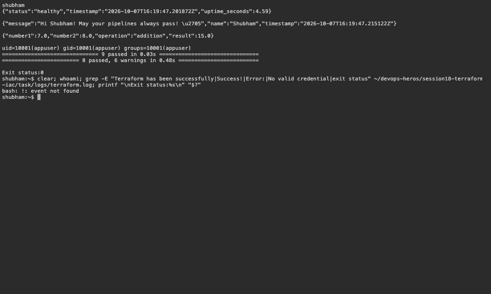

# 18 — S3 Infrastructure and AWS Services

Name: Shubham Kumar

Enrollment number: 24BCS10320

## S3 configuration

The project defines the AWS provider, a bucket, variables and outputs.

```bash
cd session18-terraform-iac/terraform-s3-demo
terraform fmt
terraform init
terraform validate
terraform plan
```

Result: initialization and validation passed. Plan failed because AWS credentials were unavailable. Apply, resource verification and destroy are pending; no AWS resources were created.

Research: [IAM](../aws-services/01-iam/README.md), [EC2](../aws-services/02-ec2/README.md), [S3](../aws-services/03-s3/README.md), [VPC](../aws-services/04-vpc/README.md), [DynamoDB/RDS](../aws-services/05-dynamodb-rds/README.md).

## Screenshots



## Command output

- [terraform](logs/terraform.log)
