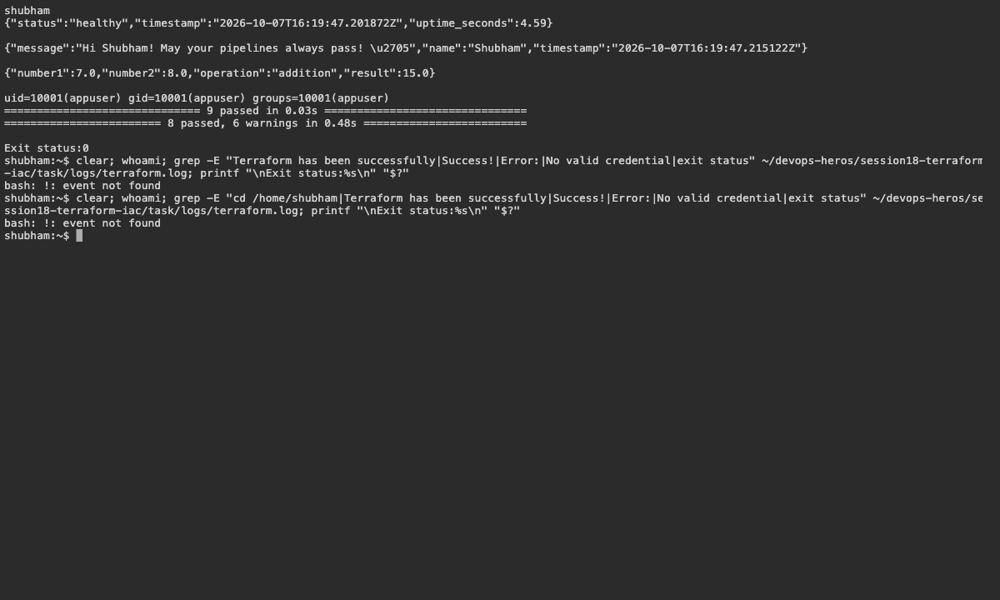

# 19 — Terraform Web Infrastructure

Name: Shubham Kumar

Enrollment number: 24BCS10320

## Resources

The project uses VPC `10.50.0.0/16` and public subnet `10.50.10.0/24`, with an Internet Gateway, route table, Security Group, nginx EC2 server and private artifacts bucket.

```bash
cd session19-cloud-terraform/mini-project
terraform init
terraform fmt
terraform validate
terraform plan
```

Resource references establish dependencies. State records managed resources; plan previews changes, apply creates them and destroy removes them.

Result: initialization and validation passed. AWS deployment, web-server verification and cleanup are pending credentials.

## Screenshots



## Command output

- [terraform](logs/terraform.log)
