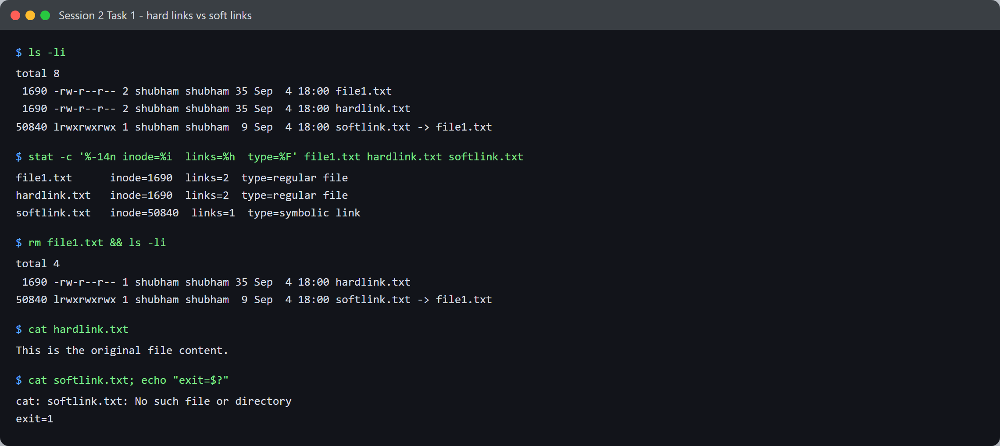
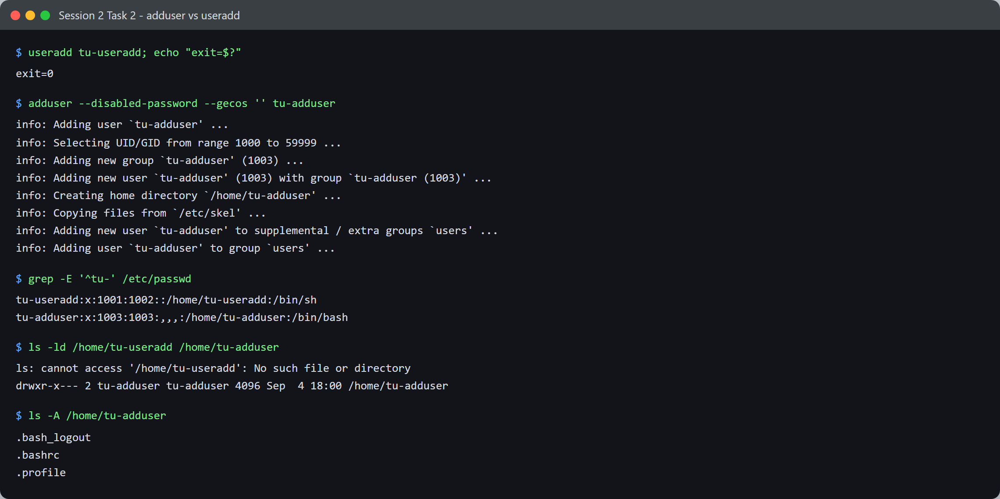

# Session 2 — Linux — Tasks

- **Name:** Shubham Kumar
- **Enrollment No:** 24BCS10320

> Run on Ubuntu 24.04.2 LTS under WSL2 (kernel 6.6.87.2-microsoft-standard-WSL2).

---

## Task 1: Hard links vs soft links

### What the task asked

Explain hard links and symbolic links, create both, compare their inode numbers, then
delete the original file and observe what happens to each link.

### Commands

```bash
echo 'This is the original file content.' > file1.txt
ln    file1.txt hardlink.txt      # hard link
ln -s file1.txt softlink.txt      # soft link (symbolic)
ls -li
```

### Output



Before deleting anything:

```text
$ ls -li
total 8
 1690 -rw-r--r-- 2 shubham shubham 35 Sep  4 18:00 file1.txt
 1690 -rw-r--r-- 2 shubham shubham 35 Sep  4 18:00 hardlink.txt
50840 lrwxrwxrwx 1 shubham shubham  9 Sep  4 18:00 softlink.txt -> file1.txt

$ stat -c '%-14n inode=%i  links=%h  type=%F' file1.txt hardlink.txt softlink.txt
file1.txt      inode=1690   links=2  type=regular file
hardlink.txt   inode=1690   links=2  type=regular file
softlink.txt   inode=50840  links=1  type=symbolic link
```

Two things to read off this:

- `file1.txt` and `hardlink.txt` share **inode 1690** and both report a link count of **2**.
  They are not original-and-copy; they are two names for one inode.
- `softlink.txt` has its **own inode (50840)** and a link count of 1. Its size is 9 bytes —
  exactly the length of the string `file1.txt`, because that is all it stores: a path.

### Now delete the original

```text
$ rm file1.txt && ls -li
total 4
 1690 -rw-r--r-- 1 shubham shubham 35 Sep  4 18:00 hardlink.txt
50840 lrwxrwxrwx 1 shubham shubham  9 Sep  4 18:00 softlink.txt -> file1.txt

$ cat hardlink.txt
This is the original file content.

$ cat softlink.txt; echo "exit=$?"
cat: softlink.txt: No such file or directory
exit=1
```

The hard link's count dropped from **2 to 1** and the data is still there. The soft link
still *exists* as a file but now points at a name that is gone — a dangling symlink.

This is what `rm` actually does: it removes a directory entry and decrements the inode's
link count. The data is only freed when that count reaches zero. Deleting `file1.txt` did
not "delete the file" — it deleted one of its two names.

### Comparison

| | Hard link | Soft link |
|---|---|---|
| Points to | the inode | a **path string** |
| Own inode? | no, shares it | yes, its own |
| Survives deleting the original | **yes** | no, becomes dangling |
| Can cross filesystems | no | yes |
| Can target a directory | no (not normally) | yes |
| Shows in `ls -l` as | `-rw-r--r--` | `lrwxrwxrwx ... -> target` |

### Interview answer

*What is the difference between a soft link and a hard link?*

A hard link is an additional directory entry pointing at the same inode, so it is
indistinguishable from the original and keeps the data alive as long as it exists. A soft
link is a small separate file whose contents are a path; it is resolved at access time, so
it breaks if the target moves or is deleted, but it can cross filesystems and point at
directories.

---

## Task 2: `adduser` vs `useradd`

### What the task asked

Compare the two commands for creating users.

### Commands

```bash
useradd tu-useradd
adduser --disabled-password --gecos '' tu-adduser
```

`adduser` is normally interactive (it prompts for a password and full name). The flags
above make it non-interactive so the run is reproducible.

### Output



`useradd` printed **nothing at all** and exited 0. `adduser` narrated every step:

```text
$ adduser --disabled-password --gecos '' tu-adduser
info: Adding user `tu-adduser' ...
info: Selecting UID/GID from range 1000 to 59999 ...
info: Adding new group `tu-adduser' (1003) ...
info: Adding new user `tu-adduser' (1003) with group `tu-adduser (1003)' ...
info: Creating home directory `/home/tu-adduser' ...
info: Copying files from `/etc/skel' ...
info: Adding new user `tu-adduser' to supplemental / extra groups `users' ...
```

The difference shows up clearly in the results:

```text
$ grep -E '^tu-' /etc/passwd
tu-useradd:x:1001:1002::/home/tu-useradd:/bin/sh
tu-adduser:x:1003:1003:,,,:/home/tu-adduser:/bin/bash

$ ls -ld /home/tu-useradd /home/tu-adduser
ls: cannot access '/home/tu-useradd': No such file or directory
drwxr-x--- 2 tu-adduser tu-adduser 4096 Sep  4 17:47 /home/tu-adduser

$ ls -A /home/tu-adduser
.bash_logout
.bashrc
.profile
```

`useradd` wrote a `/home/tu-useradd` path into `/etc/passwd` **but never created that
directory** — the user would log in with no home. It also left the shell as `/bin/sh`.
`adduser` created the home directory, populated it from `/etc/skel`, and set `/bin/bash`.

| | `useradd` | `adduser` |
|---|---|---|
| Type | low-level binary | Perl wrapper around `useradd` |
| Home directory | not created (unless `-m`) | created |
| `/etc/skel` files copied | no | yes |
| Default shell | `/bin/sh` | `/bin/bash` |
| Password prompt | no | yes (interactive) |
| Output | silent | explains each step |
| Portability | on every Linux | Debian/Ubuntu family |

**Which to use:** `adduser` interactively on a Debian/Ubuntu box; `useradd` in scripts and
on distros that have no `adduser`, remembering to pass `-m -s /bin/bash` yourself.

### Cleanup

Both test users were removed afterwards so nothing was left on the machine:

```bash
userdel -r tu-useradd
userdel -r tu-adduser
```

---

## What I learned

- `ls -li` and the link count in `ls -l` are the quickest way to tell a hard link from a
  copy — same inode, count above 1.
- A symlink's *size* is the length of the path it stores, which is a neat giveaway that it
  holds text and not data.
- `rm` decrements a link count rather than destroying data, which reframes what "deleting a
  file" means on Linux.
- `useradd` silently creating a broken account (home in `/etc/passwd` but not on disk) is a
  good example of a low-level tool doing exactly what it is told and nothing more.

## Problems I hit

- **No root at first.** `sudo` in WSL wanted a password, which blocked Task 2 entirely.
  `wsl -d Ubuntu -u root` gives a root shell without one, which is a WSL-specific way in.
- The first capture of Task 1's output came back missing its opening lines, with
  `your 131072x1 screen size is bogus` in the middle. That was WSL reporting a 1-row
  terminal to programs; exporting `LINES` and `COLUMNS` before running fixed it. Not a
  problem with the commands themselves, but it would have quietly corrupted the evidence.
