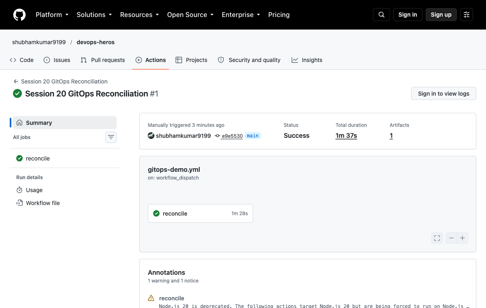
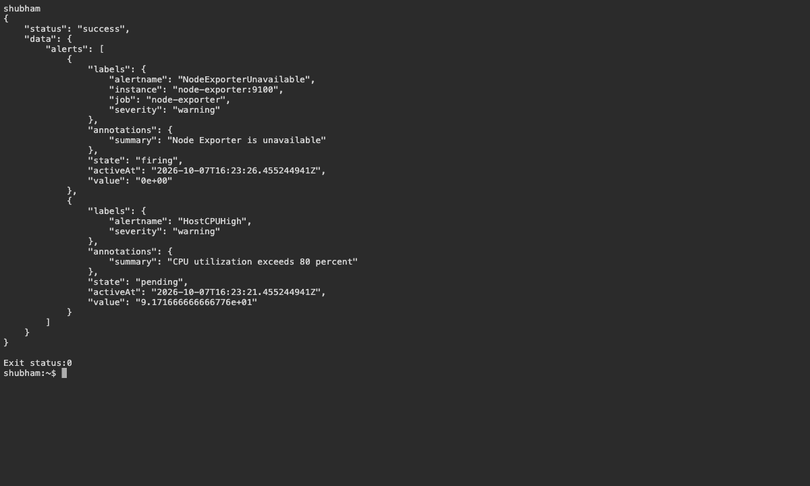
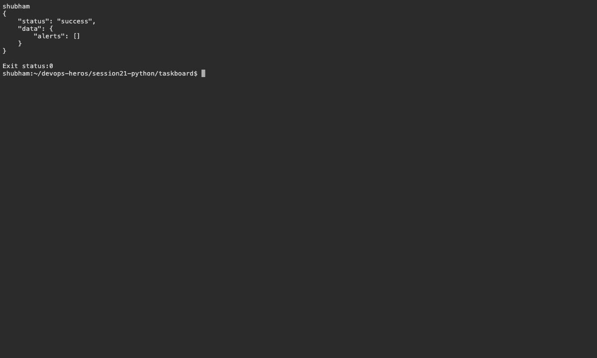
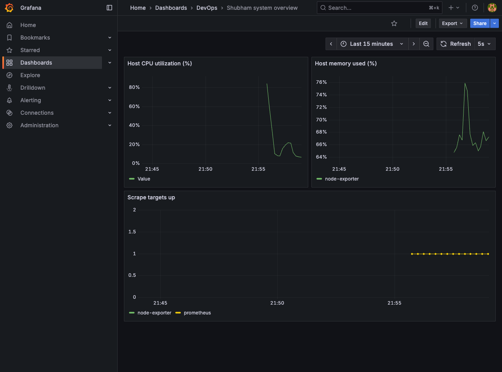
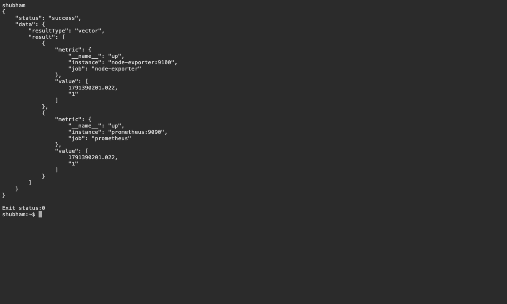

# 20 — Monitoring and GitOps

Name: Shubham Kumar

Enrollment number: 24BCS10320

## Monitoring

Prometheus scrapes Node Exporter. The Grafana dashboard **Shubham system overview** displays CPU, memory and target availability.

| Signal | Information |
|---|---|
| Metrics | Numeric measurements and alert thresholds |
| Logs | Individual events and errors |
| Traces | Request paths and time spent across services |

```bash
bash assignment-scripts/session20.sh
curl http://localhost:9090/api/v1/targets
curl http://localhost:9090/api/v1/alerts
```

Result: targets were UP. Stopping Node Exporter triggered `NodeExporterUnavailable`; restarting it cleared the alert.

## GitOps

Git stores the desired configuration; Argo CD reconciles the cluster with it. Application and bootstrap manifests are in `gitops/` and point to this repository. [GitHub run passed](https://github.com/shubhamkumar9199/devops-heros/actions/runs/37653684465): the application synchronized, served HTTP and restored two replicas after a manual scale-down. [GitOps workflow](../../.github/workflows/gitops-demo.yml).

## Screenshots











## Command output

- [GitOps run](logs/github-run.log)

- [alert firing](logs/alert-firing.log)
- [alert recovered](logs/alert-recovered.log)
- [monitoring first attempt](logs/monitoring-first-attempt.log)
- [monitoring](logs/monitoring.log)
