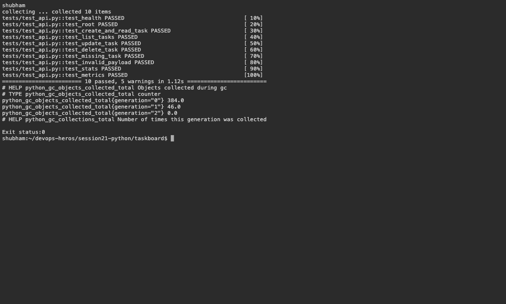
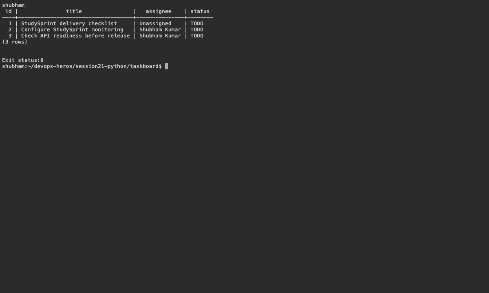
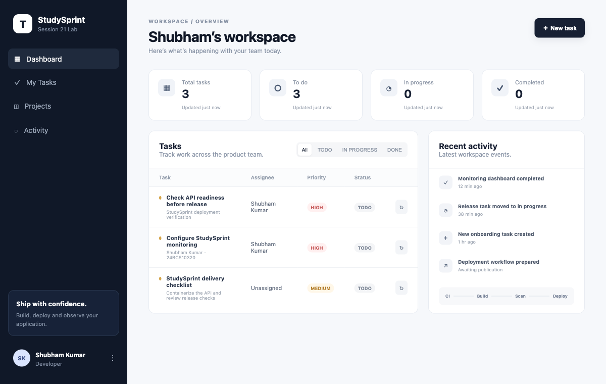
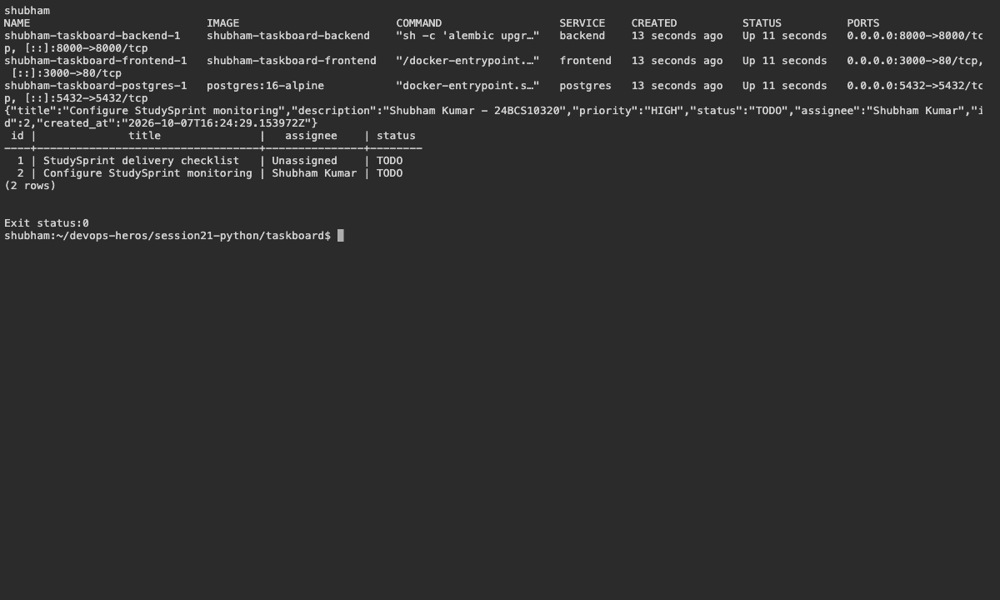

# 21 — StudySprint Reference Application

Name: Shubham Kumar

Enrollment number: 24BCS10320

## Run

The teacher's TaskBoard example is adapted as **StudySprint**, with Shubham's task data and assignee. React/nginx calls FastAPI, which stores tasks in PostgreSQL.

```bash
cd session21-python/taskboard
COMPOSE_PROJECT_NAME=shubham-taskboard docker compose up -d --build
curl http://localhost:8000/health
curl http://localhost:8000/ready
curl http://localhost:8000/api/tasks
```

Frontend: port 3000. API documentation: port 8000 at `/docs`.

Result: 10 API tests passed. A task created in the browser was retrieved through the API and verified in PostgreSQL. This is the session 21 reference-project homework.

## Screenshots









## Command output

- [compose tests](logs/compose-tests.log)
- [frontend build](logs/frontend-build.log)
