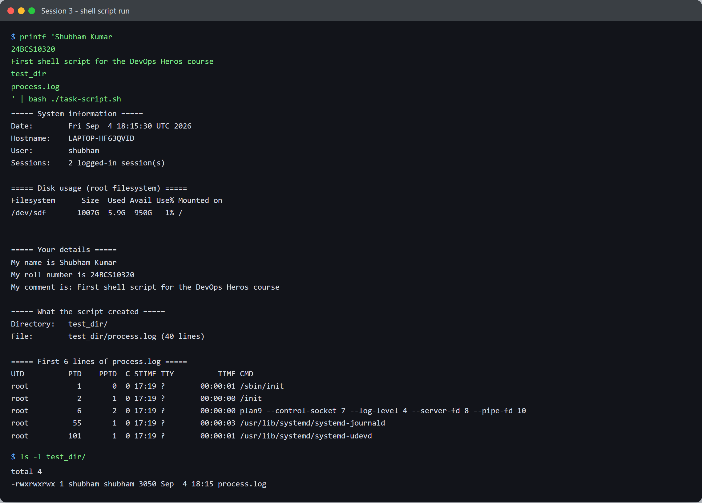

# Session 3 - Shell Scripting - Task

- **Name:** Shubham Kumar
- **Enrollment No:** 24BCS10320

> Run on Ubuntu 24.04.2 LTS under WSL2.

---

## What the task asked

From [`../task.md`](../task.md), write a script that:

- prints the current date
- prints the hostname and username
- writes process information into a file called `process.log`
- prints a name, roll number and comment
- uses **variables**, **takes input**, and **creates a file and a directory**

## The script

[`task-script.sh`](task-script.sh) - the parts that matter:

```bash
# variables via command substitution
current_date=$(date)
host_name=$(hostname)
user_name=$(whoami)
session_count=$(who | wc -l)

# take input
read -rp "Enter your name: " name
read -rp "Enter your roll number: " roll_no
read -rp "Enter a comment: " comment
read -rp "Enter a directory name to create: " dir_name
read -rp "Enter a file name for the process log: " file_name

# create the directory and write process info into a file inside it
mkdir -p "$dir_name"
ps -ef > "$dir_name/$file_name"
```

## How I ran it

The script is interactive. To make the run reproducible I piped the answers in rather than
typing them:

```bash
printf 'Shubham Kumar\n24BCS10320\nFirst shell script for the DevOps Heros course\ntest_dir\nprocess.log\n' \
  | bash ./task-script.sh
```

It also works normally - `bash ./task-script.sh` and answer the five prompts.

## Output



```text
===== System information =====
Date:        Fri Sep  4 18:15:30 UTC 2026
Hostname:    LAPTOP-HF63QVID
User:        shubham
Sessions:    2 logged-in session(s)

===== Disk usage (root filesystem) =====
Filesystem      Size  Used Avail Use% Mounted on
/dev/sdf       1007G  5.9G  950G   1% /

===== Your details =====
My name is Shubham Kumar
My roll number is 24BCS10320
My comment is: First shell script for the DevOps Heros course

===== What the script created =====
Directory:   test_dir/
File:        test_dir/process.log (40 lines)

===== First 6 lines of process.log =====
UID          PID    PPID  C STIME TTY          TIME CMD
root           1       0  0 17:19 ?        00:00:01 /sbin/init
root           2       1  0 17:19 ?        00:00:00 /init
root           6       2  0 17:19 ?        00:00:00 plan9 --control-socket 7 --log-level 4 ...
root          55       1  0 17:19 ?        00:00:03 /usr/lib/systemd/systemd-journald
root         101       1  0 17:19 ?        00:00:01 /usr/lib/systemd/systemd-udevd
```

The directory and log file it produced are committed at
[`test_dir/process.log`](test_dir/process.log) - 40 lines of real `ps -ef` output.

## What I learned

- `$( )` runs a command and substitutes its **output**, which is what makes
  `current_date=$(date)` capture the date instead of the word "date".
- Quoting matters: `mkdir -p "$dir_name"` with the quotes survives a directory name
  containing a space. Unquoted, `$dir_name` would word-split and create several directories.
- `>` truncates and creates. `ps -ef > "$dir_name/$file_name"` needed the directory to exist
  first, which is why `mkdir -p` comes before it - redirection will not create parent
  directories.
- `mkdir -p` is idempotent, so re-running the script does not fail on an existing directory.
- `read -rp` - the `-r` stops backslashes in the input being treated as escapes, which is
  almost always what you want.

## Problems I hit

- **The prompts never appeared** in my piped run, which looked broken at first. It is not:
  bash only writes a `read -p` prompt when standard input is a terminal. Piping the answers
  in means there is no terminal, so the prompts are correctly suppressed. The answers still
  land in the variables, which the "Your details" section proves.
- **A stray carriage return corrupted the directory name.** My first run created a
  directory that `ls test_dir/` then could not find. The answers were being piped in from a
  Windows process, which translated `
` into `

`, so `read` stored `test_dir
` as the
  name. WSL cannot put a CR in a filename on a Windows drive, so it encoded it as U+F00D and
  git showed the path as `test_dir\357\200\215`. Feeding the input as raw bytes fixed it.
  A good lesson in why CRLF matters when text crosses between Windows and Linux.
- Piping through `script` to force a pseudo-terminal *did* show the prompts, but all five
  answers arrived at once, so the prompts printed in a block with no answers beside them -
  less readable than the clean piped version, so I kept the piped one.
