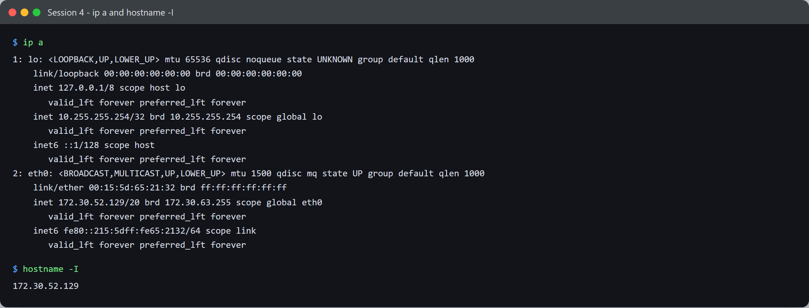
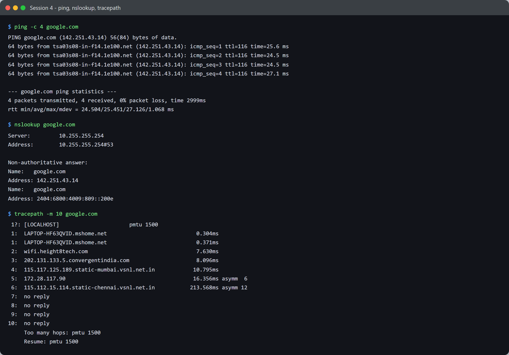
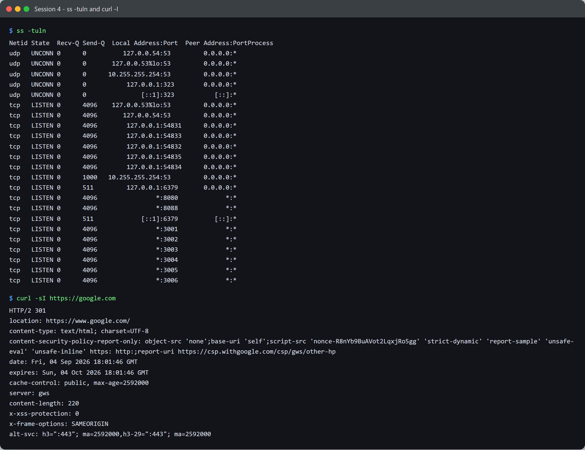

# Session 4 - Networking - Task: Commands & Analysis

- **Name:** Shubham Kumar
- **Enrollment No:** 24BCS10320

> Run on Ubuntu 24.04.2 LTS under WSL2. `nslookup` and `tracepath` were not installed;
> I added them with `apt-get install dnsutils iputils-tracepath`.

---

## What the task asked

Run a set of networking commands, capture the output, and explain what each one tells you.



## 1. `ip a`

```text
1: lo: <LOOPBACK,UP,LOWER_UP> mtu 65536 qdisc noqueue state UNKNOWN group default qlen 1000
    inet 127.0.0.1/8 scope host lo
    inet 10.255.255.254/32 brd 10.255.255.254 scope global lo
2: eth0: <BROADCAST,MULTICAST,UP,LOWER_UP> mtu 1500 qdisc mq state UP group default qlen 1000
    link/ether 00:15:5d:65:21:32 brd ff:ff:ff:ff:ff:ff
    inet 172.30.52.129/20 brd 172.30.63.255 scope global eth0
    inet6 fe80::215:5dff:fe65:2132/64 scope link
```

**Explanation.** Lists every interface with its addresses and state.

- `lo` is the loopback - always `127.0.0.1/8`, traffic that never leaves the machine. Its
  MTU of 65536 is large because nothing physical constrains it.
- `eth0` is up with `172.30.52.129/20`. The `/20` means a 4094-host subnet
  (172.30.48.0 - 172.30.63.255), matching the `brd 172.30.63.255` broadcast address.
- `00:15:5d:...` is the MAC. The `00:15:5d` prefix is Microsoft's - this is a Hyper-V
  virtual NIC, which is expected since WSL2 runs in a VM.
- `fe80::` is a link-local IPv6 address, auto-generated and not routable off the link.
- The extra `10.255.255.254/32` on `lo` is WSL-specific: it is the DNS stub the resolver
  points at, which is why it shows up again in the `nslookup` and `ss` output below.

## 2. `hostname -I`

```text
172.30.52.129
```

**Explanation.** Prints just the host's IP addresses, no interface detail. Handy in scripts
where you want the address and nothing to parse. Note it is `-I` (capital i) - lowercase
`-i` resolves via the hosts file and is less reliable.

---



## 3. `ping -c 4 google.com`

```text
PING google.com (142.251.43.14) 56(84) bytes of data.
64 bytes from tsa03s08-in-f14.1e100.net (142.251.43.14): icmp_seq=1 ttl=116 time=25.6 ms
64 bytes from tsa03s08-in-f14.1e100.net (142.251.43.14): icmp_seq=2 ttl=116 time=24.5 ms
64 bytes from tsa03s08-in-f14.1e100.net (142.251.43.14): icmp_seq=3 ttl=116 time=24.5 ms
64 bytes from tsa03s08-in-f14.1e100.net (142.251.43.14): icmp_seq=4 ttl=116 time=27.1 ms

--- google.com ping statistics ---
4 packets transmitted, 4 received, 0% packet loss, time 2999ms
rtt min/avg/max/mdev = 24.504/25.451/27.126/1.068 ms
```

**Explanation.** Sends 4 ICMP echo requests. It proves two separate things at once: DNS
resolved the name, **and** the host is reachable.

- `0% packet loss` - no drops.
- `rtt ... mdev = 1.068 ms` - mdev is the jitter. Very low here, so a stable link.
- `ttl=116` - the reply's remaining time-to-live. Started at 128 and lost 12, so the reply
  crossed roughly 12 routers.

## 4. `nslookup google.com`

```text
Server:		10.255.255.254
Address:	10.255.255.254#53

Non-authoritative answer:
Name:	google.com
Address: 142.251.43.14
Name:	google.com
Address: 2404:6800:4009:809::200e
```

**Explanation.** A DNS lookup only - no packets to google.com itself.

- `Server: 10.255.255.254#53` is the resolver used, on the standard DNS port 53. This is the
  WSL stub resolver seen on `lo` earlier.
- **Non-authoritative** means the answer came from a cache, not from Google's own
  nameservers. Normal, and faster.
- Two records come back: an **A** record (IPv4) and an **AAAA** record (IPv6).

## 5. `tracepath -m 10 google.com`

```text
 1?: [LOCALHOST]                      pmtu 1500
 1:  LAPTOP-HF63QVID.mshome.net                            0.304ms
 2:  wifi.height8tech.com                                  7.630ms
 3:  202.131.133.5.convergentindia.com                     8.096ms
 4:  115.117.125.189.static-mumbai.vsnl.net.in            10.795ms
 5:  172.28.117.90                                        16.356ms asymm  6
 6:  115.112.15.114.static-chennai.vsnl.net.in           213.568ms asymm 12
 7:  no reply
 8:  no reply
 9:  no reply
10:  no reply
     Too many hops: pmtu 1500
```

**Explanation.** Shows the path packets take, hop by hop, by increasing the TTL each time.
This trace reads as a real journey: my WSL gateway, then the local ISP wifi, then an Indian
ISP, then Mumbai, then Chennai.

- `pmtu 1500` is the path MTU, the largest packet that fits without fragmenting.
- `asymm 6` means the reply came back over a different number of hops than it went out -
  routing is not symmetric.
- **`no reply` from hop 7 onward does not mean broken.** Google's edge routers are configured
  not to send ICMP TTL-expired messages, so they stay invisible. `ping` in section 3 reached
  the destination fine, which proves the path works - the trace simply cannot see the last
  few hops. I capped it at `-m 10` because the remaining hops would never answer.

---



## 6. `ss -tuln`

```text
Netid State  Recv-Q Send-Q  Local Address:Port  Peer Address:Port
udp   UNCONN 0      0       10.255.255.254:53         0.0.0.0:*
tcp   LISTEN 0      4096     127.0.0.53%lo:53         0.0.0.0:*
tcp   LISTEN 0      511          127.0.0.1:6379       0.0.0.0:*
tcp   LISTEN 0      4096                 *:8080             *:*
tcp   LISTEN 0      4096                 *:8088             *:*
tcp   LISTEN 0      4096                 *:3001             *:*
tcp   LISTEN 0      4096                 *:3002             *:*
tcp   LISTEN 0      4096                 *:3003             *:*
tcp   LISTEN 0      4096                 *:3004             *:*
tcp   LISTEN 0      4096                 *:3005             *:*
tcp   LISTEN 0      4096                 *:3006             *:*
```

**Explanation.** Sockets on the machine. The flags: `-t` TCP, `-u` UDP, `-l` listening only,
`-n` numeric (skip resolving port names, so you see `53` not `domain`).

- `Send-Q` on a listening socket is the **accept backlog**, not queued data.
- Address scope matters: `127.0.0.1:6379` (a local Redis) is bound to loopback only, so
  nothing outside the machine can reach it. `*:3001` is bound to all interfaces and is
  externally reachable.
- **Ports 3001-3006, 8080 and 8088 are my own containers** from
  [session 6-7](../../session6-7-docker/task/) and
  [session 8](../../session8-docker-networking-volume/task/) - the six hello-world apps, the
  multi-stage app and the bind-mount nginx. A neat cross-check: `ss` on the Linux side sees
  the ports Docker Desktop published.

## 7. `curl -I https://google.com`

```text
HTTP/2 301
location: https://www.google.com/
content-type: text/html; charset=UTF-8
date: Fri, 04 Sep 2026 18:01:46 GMT
expires: Sun, 04 Oct 2026 18:01:46 GMT
cache-control: public, max-age=2592000
server: gws
content-length: 220
x-frame-options: SAMEORIGIN
alt-svc: h3=":443"; ma=2592000,h3-29=":443"; ma=2592000
```

**Explanation.** `-I` sends a `HEAD` request - headers only, no body. Useful for checking
whether something is up without downloading it.

- `HTTP/2 301` - a permanent redirect, and the connection negotiated HTTP/2 over TLS.
- `location:` shows where it redirects: bare `google.com` to `www.google.com`.
- `content-length: 220` describes the body a `GET` *would* have returned; `-I` did not fetch it.
- `alt-svc: h3=":443"` advertises HTTP/3 over QUIC as an alternative.
- `server: gws` - Google Web Server.

---

## What I learned

- `ping` succeeding proves DNS *and* reachability together; `nslookup` isolates just the DNS
  half. When something is unreachable, running both tells you which layer broke.
- `no reply` in a traceroute is usually policy, not failure. I would have misread this as a
  broken route before seeing `ping` work over the same path.
- The bind address in `ss` output is a security property: `127.0.0.1:6379` and `*:6379` are
  very different exposure levels for the same service.
- TTL in a ping reply is a rough hop counter - 116 back from a start of 128 means ~12 hops.

## Problems I hit

- **`nslookup`, `dig` and `tracepath` were all missing** on Ubuntu 24.04. They are not in the
  base image; `dnsutils` and `iputils-tracepath` provide them.
- **A transient DNS failure mid-capture.** My first recorded run had
  `ping: google.com: Temporary failure in name resolution` and a
  `communications error to 10.255.255.254#53: timed out` from `nslookup`, while `ip a` and
  `curl` were fine. The WSL DNS stub had briefly stopped answering. It recovered on its own
  and I re-ran the capture. Worth noting because the failure was in the resolver, not in
  connectivity - exactly the distinction the first bullet above describes.
