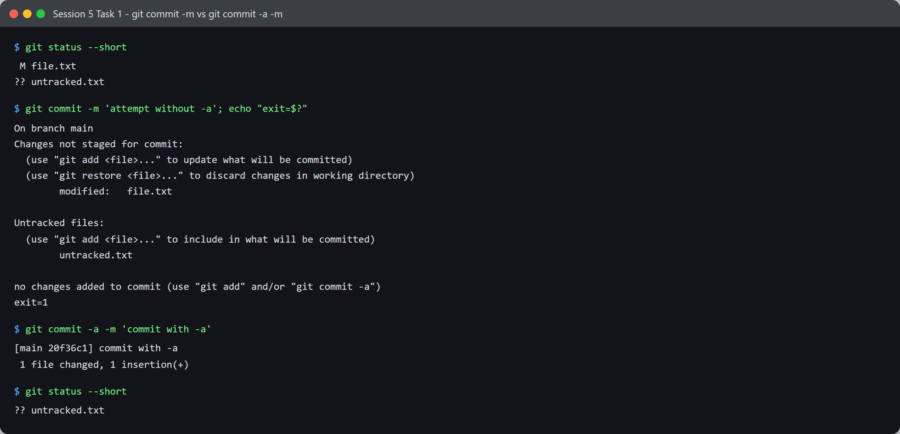
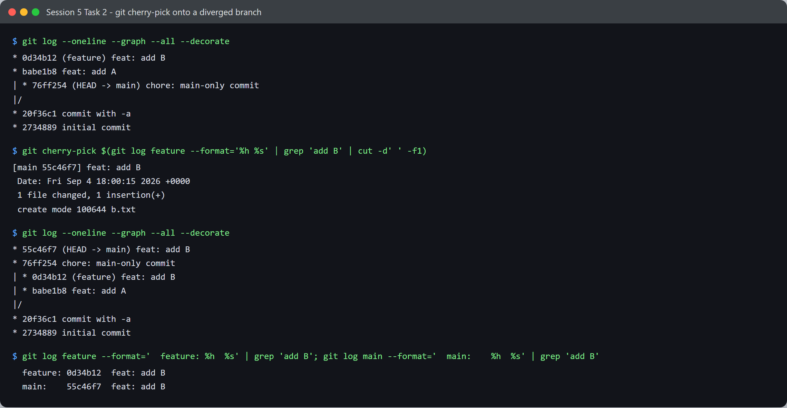
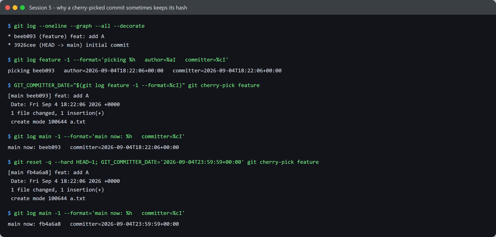

# Session 5 — Git & GitHub — Tasks

- **Name:** Shubham Kumar
- **Enrollment No:** 24BCS10320

> Demonstrated in a throwaway repo at `/tmp/git-sandbox` so nothing here interferes with
> this repository's own history.

---

## Task 1: `git commit -m` vs `git commit -a -m`

### Objective

Show what the `-a` flag actually changes.

### The theory

`git commit -m` commits **only what is already staged** (what you have `git add`-ed).
`git commit -a -m` additionally stages modifications and deletions of files git is **already
tracking**, then commits. The part people get wrong: `-a` does **not** add untracked files.

### Setup

```bash
git init -b main
echo 'line 1' > file.txt
git add file.txt
git commit -m 'initial commit'

echo 'line 2' >> file.txt        # modify a TRACKED file
echo 'brand new' > untracked.txt # create an UNTRACKED file
```

### Execution and output



```text
$ git status --short
 M file.txt
?? untracked.txt
```

`M` = tracked and modified. `??` = untracked. Now the plain commit:

```text
$ git commit -m 'attempt without -a'; echo "exit=$?"
On branch main
Changes not staged for commit:
	modified:   file.txt

Untracked files:
	untracked.txt

no changes added to commit (use "git add" and/or "git commit -a")
exit=1
```

**It refused, exit code 1.** Nothing was staged, so there was nothing to commit — git even
suggests `-a` in the error. Now with `-a`:

```text
$ git commit -a -m 'commit with -a'
[main 20f36c1] commit with -a
 1 file changed, 1 insertion(+)

$ git status --short
?? untracked.txt
```

**One file changed, not two.** `-a` picked up the `file.txt` modification and committed it,
and `untracked.txt` is still sitting there untracked. That is the whole distinction.

| | `git commit -m` | `git commit -a -m` |
|---|---|---|
| Commits staged changes | yes | yes |
| Stages modified **tracked** files | no | **yes** |
| Stages deleted **tracked** files | no | **yes** |
| Stages **untracked** (new) files | no | **no** |
| Fails when nothing staged | yes (exit 1) | only if nothing tracked changed |

So `-a` is a shortcut for `git add -u && git commit`, never for `git add -A && git commit`.
A new file always needs an explicit `git add`.

---

## Task 2: Git cherry-pick

### Objective

Take a single commit from one branch and apply it to another, without merging the branch.

### Setup

```bash
git switch -c feature
echo 'feature A content' > a.txt && git add a.txt && git commit -m 'feat: add A'
echo 'feature B content' > b.txt && git add b.txt && git commit -m 'feat: add B'
git switch main
echo 'main-only change' > main-only.txt && git add main-only.txt
git commit -m 'chore: main-only commit'   # make main diverge
```

### Execution and output



Before — the branches have diverged:

```text
$ git log --oneline --graph --all --decorate
* 0d34b12 (feature) feat: add B
* babe1b8 feat: add A
| * 76ff254 (HEAD -> main) chore: main-only commit
|/
* 20f36c1 commit with -a
* 2734889 initial commit
```

`feature` carries two commits main has never seen. Pick only `feat: add B` across:

```text
$ git cherry-pick 0d34b12
[main 55c46f7] feat: add B
 Date: Fri Sep 4 18:00:15 2026 +0000
 1 file changed, 1 insertion(+)
 create mode 100644 b.txt
```

After:

```text
$ git log --oneline --graph --all --decorate
* 55c46f7 (HEAD -> main) feat: add B
* 76ff254 chore: main-only commit
| * 0d34b12 (feature) feat: add B
| * babe1b8 feat: add A
|/
* 20f36c1 commit with -a
* 2734889 initial commit
```

Three things to read off this:

- `feat: add B` now exists on **both** branches, under **different hashes**
  (`0d34b12` on feature, `55c46f7` on main), but the patch is identical (`b.txt | 1 +`).
- `feature` is untouched — cherry-pick **copies**, it does not move or remove.
- `feat: add A` did **not** come along. That is the whole point: one commit, not the branch.

```text
$ git log feature --format='  feature: %h  %s' | grep 'add B'
  feature: 0d34b12  feat: add B
$ git log main --format='  main:    %h  %s' | grep 'add B'
  main:    55c46f7  feat: add B
```

### Why the new hash — and when it is *not* new

I first assumed cherry-pick always produces a new hash. Then one run gave me the **same**
hash on both branches, so I tested what actually decides it.

A commit's SHA is a hash of its **parent, tree, message, author identity + date, and
committer identity + date**. Cherry-pick preserves the author date but sets the committer
date to *now*. So the picked commit is byte-identical to the original only if the parent
matches **and** the committer timestamp matches.

Controlled experiment — `main` sitting exactly on `feat: add A`'s parent, changing nothing
but the committer date:



```text
$ git log --oneline --graph --all --decorate
* beeb093 (feature) feat: add A
* 3926cee (HEAD -> main) initial commit

$ git log feature -1 --format='picking %h   author=%aI   committer=%cI'
picking beeb093   author=2026-09-04T18:22:06+00:00   committer=2026-09-04T18:22:06+00:00

# 1) force the committer date to match the original
$ GIT_COMMITTER_DATE="$(git log feature -1 --format=%cI)" git cherry-pick feature
[main beeb093] feat: add A
$ git log main -1 --format='main now: %h   committer=%cI'
main now: beeb093   committer=2026-09-04T18:22:06+00:00      <-- SAME hash

# 2) identical cherry-pick, only the committer date differs
$ git reset -q --hard HEAD~1
$ GIT_COMMITTER_DATE='2026-09-04T23:59:59+00:00' git cherry-pick feature
[main fb4a6a8] feat: add A
$ git log main -1 --format='main now: %h   committer=%cI'
main now: fb4a6a8   committer=2026-09-04T23:59:59+00:00      <-- DIFFERENT hash
```

Same parent, same tree, same message, same author date — and the hash still changed the
moment the committer timestamp did. That is the deciding input.

Which explains my accidental duplicate earlier: that run created the commit and
cherry-picked it **within the same second**, so every hashed field matched and git produced
the identical commit. Once a second or more elapses, the hash differs. So "cherry-pick
creates a new commit" is true in practice, but it is the *timestamp* that usually makes it
new — not some rule that git deliberately re-labels the commit.

### When to use it

- Pulling one bug fix onto a release branch without dragging in everything else on `main`.
- Recovering a commit made on the wrong branch.
- Not a substitute for merging a whole branch — repeated cherry-picking creates duplicate
  commits that can conflict awkwardly later.

---

## What I learned

- `git status --short` is the fastest way to see the staged/unstaged/untracked split: `M`
  vs ` M` vs `??`.
- A refused commit exiting **1** matters in scripts and CI — `git commit -m` in a pipeline
  will fail the step if nothing was staged.
- A commit hash covers its parent, tree, message, author and committer plus **both**
  timestamps. My first explanation for the duplicate hash (that the parent being unchanged
  was enough) was wrong — testing it showed the committer timestamp is what actually decides.
  Worth the detour: I would have carried a wrong mental model otherwise.
- `git switch` is the modern, clearer alternative to `git checkout` for changing branches.

## Problems I hit

- My cherry-pick demo initially looked broken because the hash did **not** change, and I
  first wrote it up as "main was already the parent, so the commit is identical". That
  explanation did not survive a retest: with the same parent but a few seconds elapsed, the
  hash *did* change. The real cause was that my first run completed inside one second, so
  the committer timestamp matched too. Fixed the write-up and added the controlled
  experiment above.
