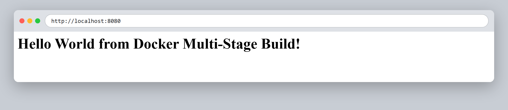
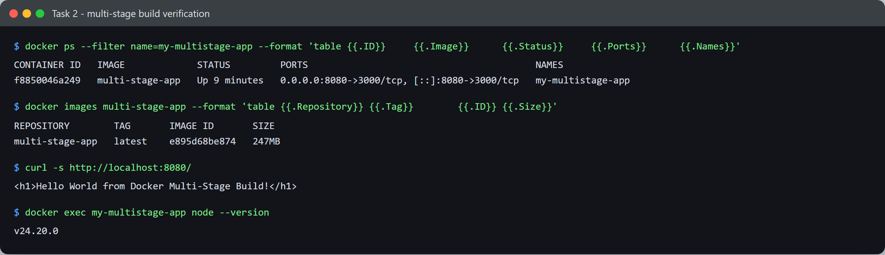

# Session 6–7 — Docker — Task 2: Multi-Stage Docker Build

- **Name:** Shubham Kumar
- **Enrollment No:** 24BCS10320

---

## What the task asked

Build the Express app in [`../multi-stage-dockerfile/`](../multi-stage-dockerfile/) using a
multi-stage Dockerfile, run it with host port `8080` mapped to container port `3000`,
and verify the output in the browser and with `docker ps`.

## Steps

1. Moved into the app directory:

   ```bash
   cd session6-7-docker/multi-stage-dockerfile
   ```

2. Built the image from the two-stage Dockerfile (`builder` → `production`):

   ```bash
   docker build -t multi-stage-app .
   ```

3. Ran it with the required port mapping:

   ```bash
   docker run -d --name my-multistage-app -p 8080:3000 multi-stage-app
   ```

## Outputs & verification

### 1. Web output



```html
<h1>Hello World from Docker Multi-Stage Build!</h1>
```

### 2. `docker ps` and terminal checks



```text
CONTAINER ID   IMAGE             STATUS         PORTS                                         NAMES
f8850046a249   multi-stage-app   Up 3 minutes   0.0.0.0:8080->3000/tcp, [::]:8080->3000/tcp   my-multistage-app
```

The port column is the thing to read here: `0.0.0.0:8080->3000/tcp` is the `-p 8080:3000`
mapping, so the app listens on 3000 inside the container and is reachable on 8080 from the host.

## Did the multi-stage build actually save anything? — measured

I was curious whether this particular Dockerfile earns its second stage, so I built a
single-stage equivalent of the same app and compared:

```bash
docker build -f Dockerfile.single -t single-stage-app .
docker images --format '{{.Repository}}\t{{.Size}}'
```

| Image | Size |
|-------|------|
| `single-stage-app` | 253 MB |
| `multi-stage-app` | 247 MB |

**Only ~6 MB.** That surprised me, and the reason is worth writing down: both stages start
from the same `node:24-alpine` base, and this app has no build step — nothing is compiled,
so there is no build output to separate from build tooling. The second stage just re-runs
`npm install --omit=dev`, which trims dev dependencies and nothing else. Almost the entire
247 MB is the Node base image itself.

Multi-stage pays off when the build stage produces something much smaller than the tools
that made it. In [Task 1](../task/) the same pattern saved far more:

- **React app** — built with Node, shipped on `nginx:alpine`: **102 MB**, and
  `command -v node` inside it returns nothing. No `node_modules`, just static files.
- **Java app** — compiled with the JDK, shipped on the JRE: `command -v javac` returns
  nothing, so the compiler is not in the shipped image.

## What I learned

- A multi-stage build is not automatically smaller. It only helps if the final stage
  starts from a leaner base or drops genuinely heavy build tooling.
- `COPY --from=<stage>` is the whole mechanism — anything not explicitly copied forward
  is discarded with the build stage, which is also a security win (no compilers or
  source in the shipped image).
- Naming stages (`AS builder`, `AS production`) makes the intent readable and lets you
  build just one with `docker build --target builder`.

## Problems I hit

- I first wrote the `docker ps` format string as `{{.IMAGE}}` and got
  `can't evaluate field IMAGE in type *formatter.ContainerContext`. The Go template
  fields are case-sensitive Go struct names — it has to be `{{.Image}}`.
