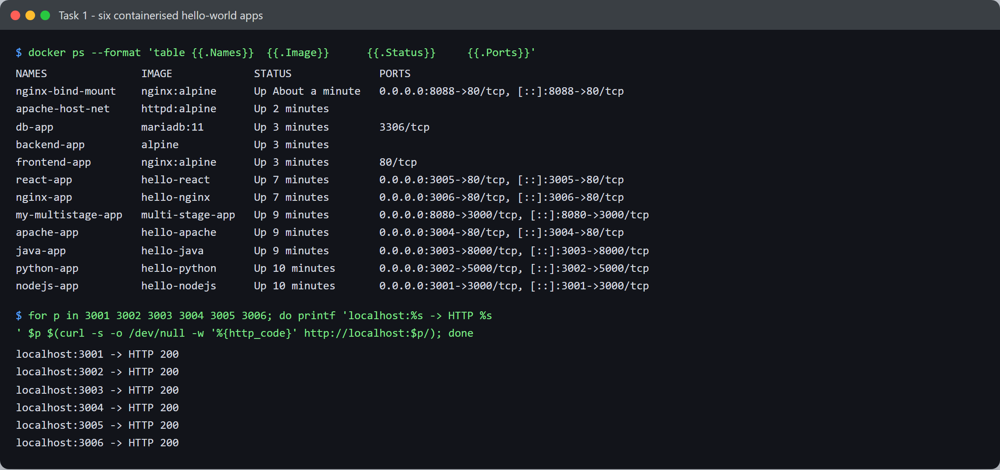
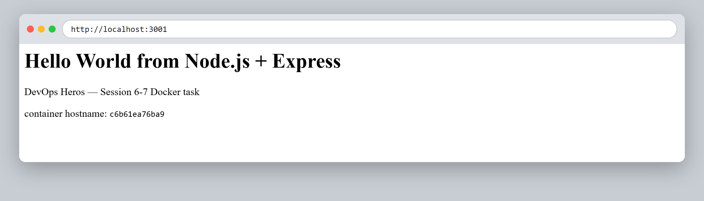
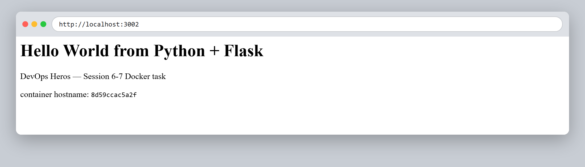
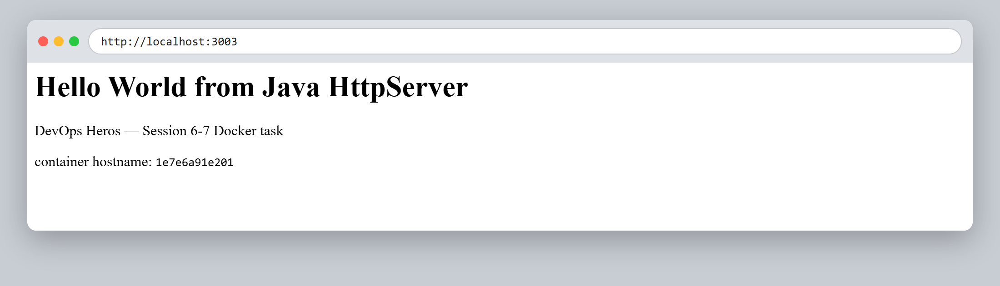
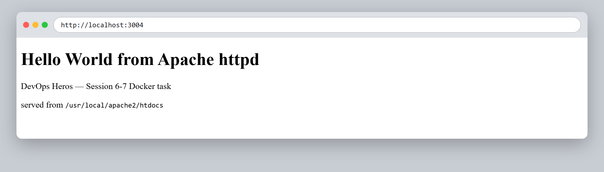
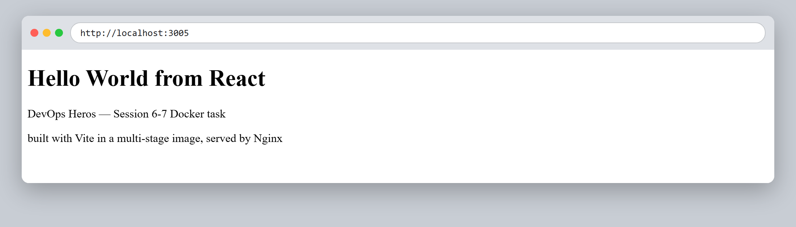
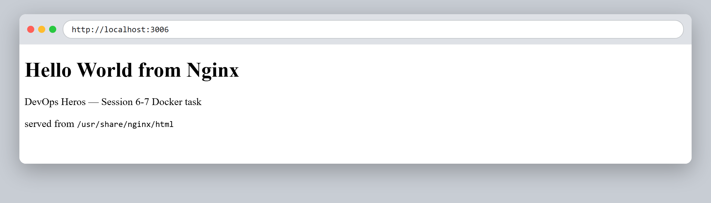

# Session 6–7 — Docker — Task 1: Hello World Applications

- **Name:** Shubham Kumar
- **Enrollment No:** 24BCS10320

---

## What the task asked

Containerise a set of simple "Hello World" web applications, one per runtime, and
verify each one serves over HTTP from its container.

## Applications built

| Folder | Runtime | Base image(s) | Container port | Host port | Image size |
|--------|---------|---------------|----------------|-----------|------------|
| `nodejs-app/` | Node.js + Express | `node:22-alpine` | 3000 | 3001 | 251 MB |
| `python-app/` | Python + Flask | `python:3.12-slim` | 5000 | 3002 | 208 MB |
| `java-app/` | Java `HttpServer` | `eclipse-temurin:21-jdk` → `21-jre` | 8000 | 3003 | 454 MB |
| `Apache-app/` | Apache httpd | `httpd:2.4-alpine` | 80 | 3004 | 96.1 MB |
| `React-app/` | React (Vite) | `node:22-alpine` → `nginx:alpine` | 80 | 3005 | 102 MB |
| `nginx-app/` | Nginx | `nginx:alpine` | 80 | 3006 | 102 MB |

Two of these use a **multi-stage build** on purpose — `java-app` (compile with the JDK,
ship only the JRE) and `React-app` (build the bundle with Node, ship only static files
on Nginx).

## How to build and run

```bash
cd <app-folder>
docker build -t <image-name> .
docker run -d --name <container-name> -p <host-port>:<container-port> <image-name>
```

Concretely, for all six:

```bash
docker build -t hello-nodejs nodejs-app  && docker run -d --name nodejs-app -p 3001:3000 hello-nodejs
docker build -t hello-python python-app  && docker run -d --name python-app -p 3002:5000 hello-python
docker build -t hello-java   java-app    && docker run -d --name java-app   -p 3003:8000 hello-java
docker build -t hello-apache Apache-app  && docker run -d --name apache-app -p 3004:80   hello-apache
docker build -t hello-react  React-app   && docker run -d --name react-app  -p 3005:80   hello-react
docker build -t hello-nginx  nginx-app   && docker run -d --name nginx-app  -p 3006:80   hello-nginx
```

## Verification

All six containers running, and every port answering `HTTP 200`:



Each app in the browser:

| | |
|---|---|
|  |  |
|  |  |
|  |  |

The Node, Python and Java pages print the container's own hostname, which is the
container ID — that is what shows the response really came from inside the container
and not from something running on the host.

## Proving the multi-stage builds actually dropped the build tooling

```bash
$ docker run --rm --entrypoint sh hello-react -c 'command -v node || echo "no node binary"'
no node binary

$ docker run --rm --entrypoint sh hello-java -c 'command -v javac || echo "no javac (JRE only)"'
no javac (JRE only)
```

The React image ships only `index.html` + `assets/` under `/usr/share/nginx/html` —
no `node_modules` at all. The Java image contains `HelloWorldServer.class` and a JRE,
no compiler.

## What I learned

- Choosing the base image matters far more than anything in the Dockerfile: the same
  trivial app is 96 MB on `httpd:alpine` and 454 MB on a Temurin JRE.
- `EXPOSE` is documentation only — it does not publish anything. The `-p host:container`
  flag on `docker run` is what actually opens the port.
- Copying `package.json` and running the install *before* copying source keeps the
  dependency layer cached, so editing source rebuilds in seconds instead of re-installing.
- A server must bind `0.0.0.0`, not `127.0.0.1`. Binding to localhost inside the
  container makes it unreachable through a published port.

## Problems I hit

- **`nginx:alpine` failed to pull mid-build**, twice, with
  `dial tcp: lookup production.cloudfront.docker.com: no such host`. This broke both
  `nginx-app` and `React-app` while the other four built fine. It was a transient DNS
  failure against Docker's CDN, not a Dockerfile problem — a plain
  `docker pull nginx:alpine` succeeded on retry and both images then built first time.
  Worth remembering that a "build failure" can be purely network.
- The React page looked blank to `curl` at first. That was expected, not a bug: Vite
  ships an empty `<div id="root">` and React fills it in with JavaScript, so only a real
  browser shows the text. `curl` can only prove the server responds, not that the app renders.
