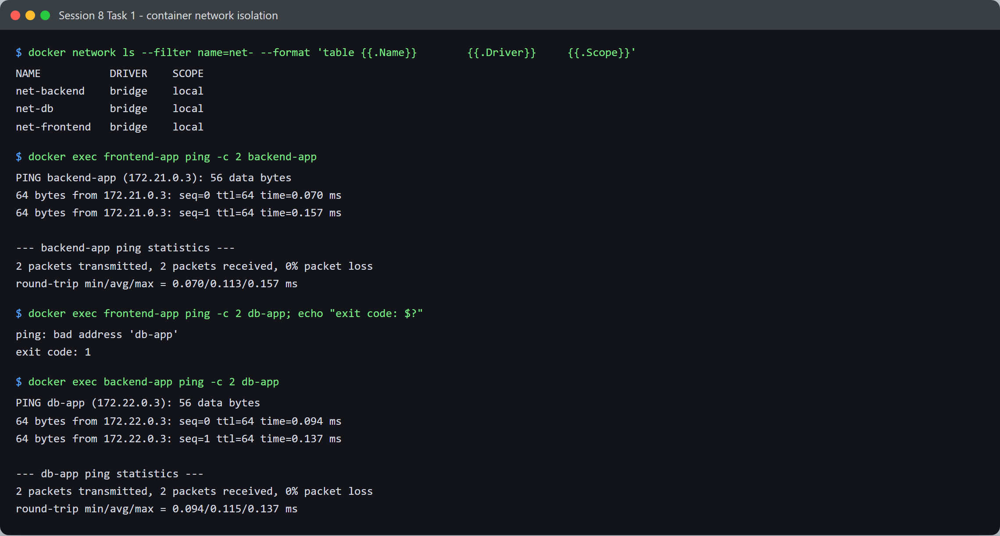
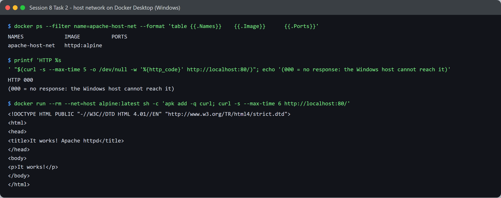
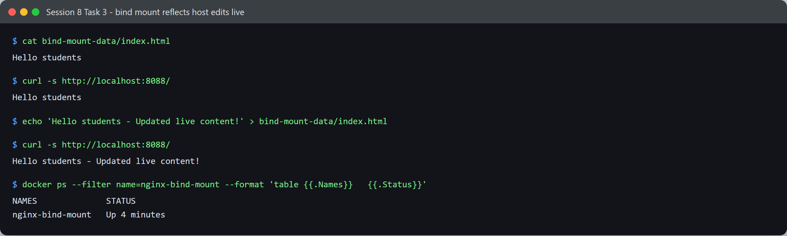

# Session 8 — Docker Networking & Volumes — Tasks

- **Name:** Shubham Kumar
- **Enrollment No:** 24BCS10320

---

## Task 1: Container networking and isolation

### What the task asked

Create three bridge networks, place three containers so that one of them bridges two
networks, and prove which containers can reach each other.

### Setup

```bash
docker network create net-frontend
docker network create net-backend
docker network create net-db

docker run -d --name frontend-app --network net-frontend nginx:alpine
docker run -d --name backend-app  --network net-frontend alpine sleep 3600
docker network connect net-backend backend-app          # backend now sits on BOTH
docker run -d --name db-app --network net-backend -e MARIADB_ROOT_PASSWORD=secret mariadb:11
```

Resulting topology — `backend-app` is the only container on two networks:

| Container | Networks (with IP) |
|-----------|--------------------|
| `frontend-app` | `net-frontend` (172.21.0.2) |
| `backend-app` | `net-frontend` (172.21.0.3), `net-backend` (172.22.0.2) |
| `db-app` | `net-backend` (172.22.0.3) |

`net-db` was created as the task asked, but nothing was attached to it.

### Connectivity results



**1. frontend → backend** — same network, works:

```text
$ docker exec frontend-app ping -c 2 backend-app
PING backend-app (172.21.0.3): 56 data bytes
64 bytes from 172.21.0.3: seq=0 ttl=64 time=0.226 ms
64 bytes from 172.21.0.3: seq=1 ttl=64 time=0.164 ms
2 packets transmitted, 2 packets received, 0% packet loss
```

**2. frontend → db** — no shared network, fails:

```text
$ docker exec frontend-app ping -c 2 db-app; echo "exit code: $?"
ping: bad address 'db-app'
exit code: 1
```

**3. backend → db** — both on `net-backend`, works:

```text
$ docker exec backend-app ping -c 2 db-app
PING db-app (172.22.0.3): 56 data bytes
64 bytes from 172.22.0.3: seq=0 ttl=64 time=0.069 ms
64 bytes from 172.22.0.3: seq=1 ttl=64 time=0.093 ms
2 packets transmitted, 2 packets received, 0% packet loss
```

The detail I found most interesting: test 2 fails with **`bad address`**, not with a
timeout. The isolation happens at *DNS resolution*, before any packet is sent — Docker's
embedded DNS server only resolves container names within networks the asking container is
actually attached to. `db-app` is not a name `frontend-app` can even look up.

---

## Task 2: Host network

### What the task asked

Run Apache with `--net=host` and access it on port 80.

### Commands

```bash
docker run -d --name apache-host-net --net=host httpd:alpine
curl http://localhost:80
```

### Result — and a platform difference worth documenting



Note the `docker ps` output first: with `--net=host` the **PORTS column is empty**, because
there is no port mapping — the container uses the host's network stack directly.

From the Windows host, port 80 was **not** reachable:

```text
$ printf 'HTTP %s\n' "$(curl -s --max-time 5 -o /dev/null -w '%{http_code}' http://localhost:80/)"
HTTP 000
(000 = no response: the Windows host cannot reach it)
```

But from inside the Docker VM's own host namespace, Apache was serving fine all along:

```text
$ docker run --rm --net=host alpine:latest sh -c 'apk add -q curl; curl -s --max-time 6 http://localhost:80/'
<!DOCTYPE HTML PUBLIC "-//W3C//DTD HTML 4.01//EN" "http://www.w3.org/TR/html4/strict.dtd">
<html>
<head>
<title>It works! Apache httpd</title>
</head>
<body>
<p>It works!</p>
</body>
</html>
```

**Why:** Docker Desktop on Windows does not run containers on Windows itself — it runs them
inside a Linux VM. So `--net=host` means *the VM's* network, not Windows'. Apache really is
on port 80 of the host network, just a host that isn't my laptop. Since there is no published
port, Docker Desktop has nothing to forward from Windows into the VM, so `localhost:80` on
Windows hits nothing.

On native Linux, where the daemon and the host are the same machine, `curl http://localhost:80`
would have returned `It works!` directly. Docker Desktop has an opt-in host-networking feature
that forwards this case, but it is not enabled in this install.

I kept both results rather than only the working one, because the contrast is the actual
lesson: `--net=host` is not portable, and that is a real reason to prefer `-p` mappings.

---

## Task 3: Bind mount

### What the task asked

Mount a local folder into an Nginx container, then change a file on the host and confirm the
change is served without restarting the container.

### Commands

```bash
mkdir -p bind-mount-data
echo "Hello students" > bind-mount-data/index.html

docker run -d --name nginx-bind-mount -p 8088:80 \
  -v "$(pwd)/bind-mount-data:/usr/share/nginx/html" nginx:alpine
```

### Verification



```text
$ curl -s http://localhost:8088/
Hello students

$ echo 'Hello students - Updated live content!' > bind-mount-data/index.html

$ curl -s http://localhost:8088/
Hello students - Updated live content!

$ docker ps --filter name=nginx-bind-mount
NAMES              STATUS
nginx-bind-mount   Up About a minute
```

The `Up About a minute` is the part that matters — the uptime never reset, so the container was
not restarted between the two `curl` calls. The host directory *is* the directory Nginx serves
from; there is no copy step.

On Windows the mount source has to be a path Docker Desktop can translate, so I passed a
`C:/Users/...` style path. Running this from Git Bash also needed `MSYS_NO_PATHCONV=1`,
otherwise MSYS rewrites the `/usr/share/nginx/html` half of the `-v` argument into a Windows
path and the mount lands in the wrong place.

---

## Task 4: Overlay network research

### What an overlay network is

A bridge network only spans one Docker host. An **overlay** network spans *several* Docker
hosts, giving containers on different physical machines one flat virtual layer-2 network where
they can talk by container name, as if they were on the same box.

### How it works

- Container traffic is wrapped in **VXLAN** — the original layer-2 Ethernet frame is
  encapsulated inside a UDP packet (default port **4789**) and sent across the physical network
  to the right host, which unwraps it.
- Each participating host holds a **VXLAN tunnel endpoint (VTEP)**; Docker keeps the mapping of
  which container and MAC address live on which host.
- Membership and endpoint state are shared between managers and workers using a **gossip
  protocol**, so every node learns where a given container is.
- Because the underlying transport is just UDP, the physical network in between needs no
  awareness of container addressing at all.

### Main use cases

1. **Docker Swarm / multi-host clusters** — services scheduled onto any node still reach each
   other by service name.
2. **Encrypted container-to-container traffic** — `docker network create --opt encrypted` adds
   IPsec to the VXLAN tunnels, which matters when hosts talk over a network you do not control.
3. **Service discovery and load balancing** — Swarm's built-in DNS resolves a service name to a
   virtual IP and spreads connections across that service's tasks, wherever they run.

### How it relates to Task 1

Task 1's isolation was all on one host. The same *model* — named networks, DNS scoped to
attached networks, a container able to join more than one — carries over to overlay networks.
The only difference is that the members can now live on different machines. So the
`net-frontend` / `net-backend` split above is exactly how you would separate tiers in a Swarm,
just spanning hosts.

---

## What I learned overall

- Container isolation is enforced at **DNS**, not only at the packet level. `bad address` vs a
  hang is a genuinely useful diagnostic — one means "not on a shared network", the other means
  "resolved, but nothing answered".
- Attaching one container to two networks (`docker network connect`) is the normal way to build
  a tiered app where the frontend cannot touch the database directly.
- `--net=host` behaves differently on Docker Desktop than on Linux, because "host" is the VM.
  Anything relying on it is not portable.
- A bind mount is a live view of a host directory, not a copy — great for development, and a bad
  idea for anything you want the image to own.

## Problems I hit

- **`--net=host` appeared to be broken.** `docker ps` showed the container up but
  `curl localhost:80` from Windows returned nothing. My first instinct was that Apache had
  crashed. Checking from inside the VM's namespace showed it was serving correctly the whole
  time, which turned the "failure" into the actual finding above.
- **The `-v` path was rewritten by Git Bash.** MSYS path conversion mangled the container side
  of the mount. `MSYS_NO_PATHCONV=1` fixed it.
- MariaDB is a **453 MB** pull, which dominated the setup time for a container that only needed
  to exist in order to be pinged.
