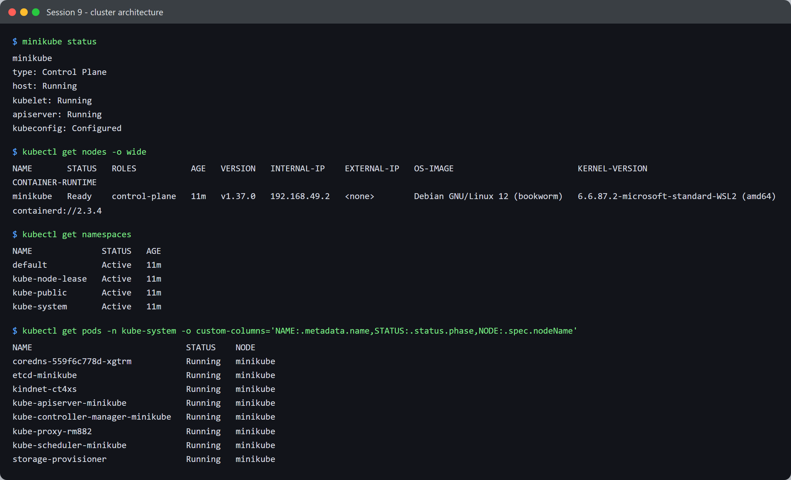
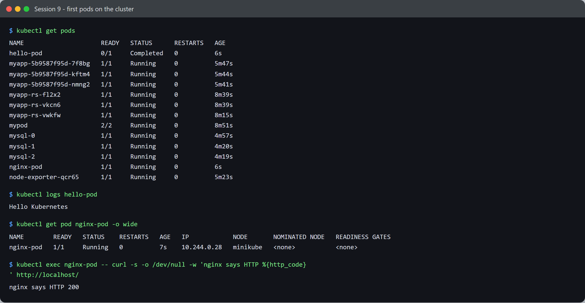

# Session 9 - Kubernetes - Task

- **Name:** Shubham Kumar
- **Enrollment No:** 24BCS10320

---

## What the task asked

[`../Readme.md`](../Readme.md) gives resource links rather than a written task, so I took the
session's scope from them - the Kubernetes Basics tutorial and the cluster **architecture**
docs, with minikube as the suggested local cluster. So this task is: get a real cluster
running, identify the control-plane components in it, and run a first workload.

The core objects themselves are covered separately in
[session 10](../../session10-k8s-core-objects/task/).

## Cluster setup

`kubectl` was already present (bundled with Docker Desktop) but there was no cluster -
`kubectl config get-contexts` returned an empty list. I installed minikube and started it
against the running Docker daemon:

```bash
curl -fL -o minikube.exe \
  https://github.com/kubernetes/minikube/releases/latest/download/minikube-windows-amd64.exe
minikube start --driver=docker --cpus=2 --memory=3000
```

minikube **v1.39.0**, Kubernetes **v1.37.0**.

## Cluster architecture



```text
$ minikube status
minikube
type: Control Plane
host: Running
kubelet: Running
apiserver: Running
kubeconfig: Configured

$ kubectl get nodes -o wide
NAME       STATUS   ROLES           AGE   VERSION   INTERNAL-IP    OS-IMAGE                       CONTAINER-RUNTIME
minikube   Ready    control-plane   11m   v1.37.0   192.168.49.2   Debian GNU/Linux 12 (bookworm) containerd://2.3.4
```

One node, and it carries the `control-plane` role - with `--driver=docker` the whole "cluster"
is a single Debian container running both the control plane and the workloads. The container
runtime is **containerd**, not Docker: minikube runs inside a Docker container but manages
pods with containerd. That distinction matters, because it means `docker ps` on my laptop
does **not** list the pods.

### Namespaces

```text
$ kubectl get namespaces
NAME              STATUS   AGE
default           Active   11m
kube-node-lease   Active   11m
kube-public       Active   11m
kube-system       Active   11m
```

- `default` - where my own objects land when I do not specify one.
- `kube-system` - the cluster's own components.
- `kube-public` - world-readable cluster info, used during bootstrap.
- `kube-node-lease` - holds one Lease object per node; the node heartbeats by renewing it,
  which scales better than patching node status.

### The control plane, as actual pods

```text
$ kubectl get pods -n kube-system
NAME                               STATUS    NODE
coredns-559f6c778d-xgtrm           Running   minikube
etcd-minikube                      Running   minikube
kindnet-ct4xs                      Running   minikube
kube-apiserver-minikube            Running   minikube
kube-controller-manager-minikube   Running   minikube
kube-proxy-rm882                   Running   minikube
kube-scheduler-minikube            Running   minikube
storage-provisioner                Running   minikube
```

This is the architecture diagram made concrete. What each one does:

| Component | Role |
|---|---|
| `kube-apiserver` | The only front door. Every `kubectl` command and every controller talks to it; nothing writes to etcd directly. |
| `etcd` | The key-value store holding all cluster state. The single source of truth - lose it and you lose the cluster. |
| `kube-scheduler` | Watches for pods with no node assigned and picks a node for each. It only *decides*; it does not start anything. |
| `kube-controller-manager` | Runs the reconciliation loops (ReplicaSet, Deployment, Node, and others) that drive actual state toward desired state. |
| `kube-proxy` | Programs node networking so Service virtual IPs route to the right pods. |
| `coredns` | Cluster DNS, so pods can resolve each other and Services by name. |
| `kindnet` | The CNI plugin providing the pod network (minikube's default here). |
| `storage-provisioner` | minikube addon that fulfils PersistentVolumeClaims dynamically. |

Two things I found clarifying:

- The control plane is **just pods**. `etcd`, the API server and the scheduler are workloads
  on the cluster they run. They are static pods started by the kubelet from manifests on
  disk, which is how the cluster bootstraps before an API server exists to ask.
- The node was `NotReady` for the first ~90 seconds after `minikube start` returned. That is
  not a fault - the kubelet reports `NotReady` until the CNI plugin is up, because a node
  with no pod network cannot host pods.

## First workloads



### A run-to-completion pod

[`hello.yml`](../../session10-k8s-core-objects/hello.yml) runs busybox with
`restartPolicy: Never`:

```text
$ kubectl apply -f hello.yml
pod/hello-pod created

$ kubectl get pods
NAME        READY   STATUS      RESTARTS   AGE
hello-pod   0/1     Completed   0          6s

$ kubectl logs hello-pod
Hello Kubernetes
```

`Completed` with `0/1` ready is success, not failure - the container's job was to echo one
line and exit. `restartPolicy: Never` is what stops Kubernetes restarting it in a loop.
`kubectl logs` still works after the container exits, because the log is kept with the pod
object.

### A long-running pod

```text
$ kubectl get pod nginx-pod -o wide
NAME        READY   STATUS    RESTARTS   AGE   IP            NODE
nginx-pod   1/1     Running   0          7s    10.244.0.28   minikube

$ kubectl exec nginx-pod -- curl -s -o /dev/null -w 'nginx says HTTP %{http_code}\n' http://localhost/
nginx says HTTP 200
```

The pod got cluster IP `10.244.0.28` from the CNI. `kubectl exec` runs a command inside the
container, and `localhost` there is the **pod's** network namespace, not my laptop - which is
why port 80 answers with no port mapping anywhere.

> The `kubectl get pods` screenshot also shows `myapp-*`, `mypod`, `mysql-*` and
> `node-exporter-*`. Those are the session 10 objects; I did that task first and left them
> running.

## What I learned

- "Control plane" is a set of ordinary pods in `kube-system`, not hidden machinery.
- Everything goes through the API server. The scheduler and controllers do not talk to each
  other or to etcd - they all watch and write via the API. That is why one component being
  down produces such specific symptoms.
- `NotReady` immediately after startup usually means the CNI has not finished, not that
  something is broken.
- A `Completed` pod is a normal successful outcome for a task-shaped workload. `0/1 READY`
  looks alarming until you realise READY tracks *serving*, not *succeeded*.
- minikube's node runs **containerd** even though the driver is Docker, so laptop-level
  `docker ps` cannot see pod containers.

## Problems I hit

- **No cluster to begin with.** `kubectl` existed and looked functional, but every command
  failed to connect because Docker Desktop's Kubernetes was never enabled and no context
  existed. `kubectl config get-contexts` returning nothing was the giveaway.
- **The kicbase image is a ~500 MB download**, so the first `minikube start` took several
  minutes with no obvious progress at first.
- I checked `kubectl get nodes` as soon as `minikube start` finished and saw `NotReady`,
  which looked like a failed start. Waiting ~40 more seconds resolved it - the CNI was still
  coming up.
